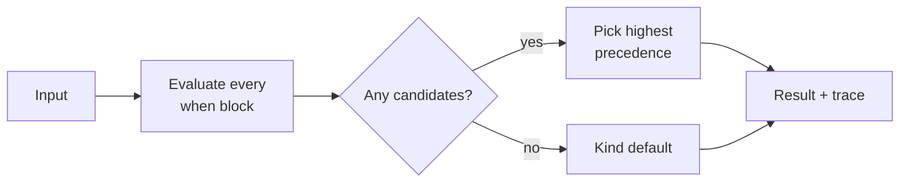

# Sigil

A small, statically typed policy language for Go hosts.


📖 **Language documentation:** [the docs site](./docs) &nbsp;·&nbsp; 🧭 **Where it stands:** [roadmap](./roadmap.yml) and [open questions](./docs/project/open-questions.md)

Sigil lets engineers write rules that evaluate host-provided input to a typed decision such as `approve`, `deny` or `review`. Every decision carries a reason and a payload, every policy is type-checked against a contract the host defines in Go, and every evaluation is guaranteed to halt. It ships as an importable Go library, in the spirit of [filt-rs](https://github.com/SierraSoftworks/filters), and it's meant to replace the YAML rule engines with label-selector matchers that teams keep rebuilding.

> [!IMPORTANT]
> Sigil is being designed documentation-first. **Nothing is implemented yet.** The [documentation](./docs) is the specification, and it'll change as the [open questions](./docs/project/open-questions.md) get settled. Feedback on the language design is the most useful contribution right now; please [open an issue](https://github.com/SpechtLabs/sigil/issues).

## What it looks like

The example below gates production deployments: a platform team writes shared policies, and a product team composes them with its own settings.

**The kind** is the contract. The host defines it in Go and exports it as `deploy_approval.sigil`; nobody writes it by hand.

```sigil
kind DeployApproval version 1

type Release {
  soak: duration
  hotfix: bool
}
type Service {
  name: string
  tier: string
  owners: list<string>
  labels: map<string, string>
}
type Actor {
  name: string
  teams: list<string>
  roles: list<string>
  regions: list<string>
}

input release: Release
input service: Service
input actor: Actor
input environment: string

fn split(s: string, sep: string) -> list<string>

decision deny(reason: string)
decision review(reason: string, approvers: list<string>)
decision approve(reason: string, bake: duration = 1h)

precedence deny > review > approve
default deny("no_rule_matched")
```

**A module** holds shared matchers. `let`s name conditions; a module has nothing else, so importing from it can never change a decision.

```sigil
module deploy.common: DeployApproval

let owns_service = actor.teams any in service.owners
let cleared =
  split(service.labels["regions"], ",") all in actor.regions
let eligible =
  "deployer" in actor.roles
  and environment == "production"
  and service.labels has {
    "app.kubernetes.io/managed-by": "argocd",
    "platform.example.com/lifecycle": "ga",
  }
```

**Two platform policies** hold the rules: guardrails that deny, and approvals that teams tune. `use` imports names; `param`s make a policy reusable.

```sigil
policy deploy.guardrails: DeployApproval

use deploy.common.{eligible}

param min_soak: duration = 24h

when not eligible {
  deny("not_eligible")
}

when release.soak < min_soak and not release.hotfix {
  deny("soak_too_short")
}
```

```sigil
policy deploy.production: DeployApproval

use deploy.common.{cleared, owns_service}

param approvers: list<string>
param tiers: list<string> = ["standard", "internal"]

when cleared {
  when service.tier == "critical"
    and "release_manager" in actor.roles {
    approve("release_manager")
  }

  when service.tier in tiers
    and owns_service {
    review("service_owner", approvers: approvers)
  }
}
```

**A team policy** invokes the platform's policies like decision constructors, with its own values. Inside a `when`, an invocation's rules only apply where the condition holds, so PCI-scoped services get a second approver group. The team also adds a rule of its own.

```sigil
policy payments.production: DeployApproval

use deploy.guardrails
use deploy.production
use deploy.common.{cleared}

guardrails(min_soak: 4h)

when service.labels["compliance"] == "pci" {
  production(approvers: ["payments-leads", "security-leads"])
}

when service.labels["compliance"] != "pci" {
  production(approvers: ["payments-leads"])
}

when cleared and "payments-sre" in actor.teams {
  approve("payments_sre", bake: 15m)
}
```

The team rule can only add an approval. The guardrails' `not_eligible` and `soak_too_short` denies still win over it, because the kind ranks `deny` above `approve`, and the host requires `deploy.guardrails` to be invoked unconditionally, so no team can wrap it in a `when` to switch it off.

The host evaluates the compiled policy and gets a typed result back:

```go
p, err := Deploy.Load(policies, "payments.production",
	policy.Require("deploy.guardrails"))
if err != nil {
	log.Fatal(err) // file:line:col plus a fix hint
}

res, err := p.Eval(ctx, input)
if r, ok := Review.Match(res); ok {
	requestReview(r.Approvers, res.Reason) // r is a typed ReviewData
}
```

## Design goals

- **Readable on first contact.** Terse is fine; Rego-style logic programming isn't.
- **Finite and halting by design.** No loops, no recursion, no user-defined functions, so evaluation cost depends only on list sizes and can be bounded before a policy ships.
- **Typed against the host's contract.** Unknown fields, type mismatches and wrong payload keys fail at compile time. A typo can't silently switch a deny rule off.
- **Self-describing decisions.** A mandatory, literal reason on every decision, plus a typed payload the host acts on.
- **Composable from day one.** Typed `param`s, `use` imports and policy invocation replace text templating for per-team variants, and `sigil explain` flattens any composition back into the rules it adds up to.
- **Parse once, evaluate many.** A compiled policy is immutable and safe for concurrent use.

Out of scope: general computation, evaluators in languages other than Go (for now), and org-wide authorization in the style of OPA or Cedar. Sigil targets decisions embedded in a single application.

## How evaluation works

Every `when` block is evaluated, independently and in no particular order. Each decision constructor reached becomes a candidate, and the candidate whose decision ranks highest in the kind's `precedence` wins. If nothing fires, the kind's `default` applies. Rule order never changes which decision wins (it only breaks ties between candidates of the same decision, an [open question](./docs/project/open-questions.md)), and there's no `else`: `when not x` says the same thing without implying order.



The host gets back the winning decision, its reason and payload, the policy that produced it, and a trace of every candidate. An invoked policy's rules join the same pool, with the conditions of any `when` around the call added to each of them.

## Prior art

| Project | What Sigil takes | What it avoids |
| --- | --- | --- |
| [filt-rs](https://github.com/SierraSoftworks/filters) | Friendly expression syntax, `in`/`like`/`contains`, durations, parse once / eval many, errors with a fix hint | Unknown properties resolving to `null`, which makes deny rules fail open |
| [Cedar](https://www.cedarpolicy.com/) | Schema-checked policies, forbid overrides permit, templates with slots | A principal/action/resource model too narrow for arbitrary host inputs |
| [CEL](https://github.com/google/cel-go) | Non-Turing-complete by construction, static cost estimation, host-declared variables and functions | Being an expression language only, with no rules, decisions or composition |
| [Rego (OPA)](https://www.openpolicyagent.org/docs/latest/policy-language/) | The lesson about learning curves | Datalog semantics, implicit iteration, partial rule sets |
| HCL / YAML DSLs | The declarative feel | Nesting that fights templating, anchors as reuse, stringly typed matchers |

## Documentation

The docs site lives in [`docs/`](./docs) and follows the [Diátaxis](https://diataxis.fr/) layout.

| Section | What's there |
| --- | --- |
| [Getting started](./docs/getting-started/overview.md) | What Sigil is, a tour of the language, and a first policy built step by step |
| [Guides](./docs/guides/team-policies.md) | Per-team policies, common patterns, evolving a kind without breaking policies |
| [Understanding](./docs/understanding/design-goals.md) | Why the language is shaped this way: order independence, strictness, halting, composition and required guardrails |
| [Reference](./docs/reference/policy-files.md) | The language specification: lexical structure, statements, expressions, types, decisions, evaluation, kind files, grammar |
| [Project](./docs/project/open-questions.md) | Open design questions, plus the roadmap rendered from [`roadmap.yml`](./roadmap.yml) |

To run the site locally you need [mise](https://mise.jdx.dev/), which installs the pinned toolchain:

```bash
mise install
mise run docs-dev
```

## Roadmap

Documentation comes first. Implementation starts once the language specification has settled, and the hand-written parser (recursive descent for statements, Pratt parsing for expressions) comes before anything else.

| Milestone | Scope | State |
| --- | --- | --- |
| M1 Language specification | Reference, grammar, rationale, answers to the syntax-affecting open questions | In progress |
| M2 Expressions | Lexer, Pratt parser, AST with positions, error hints | Planned |
| M3 Types | `NewKind` reflection, type checker, evaluator over Go structs | Planned |
| M4 Policies | `when`, decision constructors, precedence, default, trace | Planned |
| M5 Composition | `param`, `let`, modules and imports, policy invocation, `Require`, `fs.FS` loader, cycle detection, `sigil explain` | Planned |
| M6 Tooling I | `sigil fmt`, kind export, `sigil check`, `sigil eval`, `sigil test` | Planned |
| M7 Hardening | `LoadKind`, round-trip property tests, parser fuzzing, cost analysis | Planned |
| M8 Tooling II | `sigil lsp`, `sigil gen go`, `sigil breaking` | Planned |

At M4 the language can replace an existing YAML rule set, such as the deploy gate shown above. The roadmap lives in [`roadmap.yml`](./roadmap.yml) in the [roadmap-md](https://roadmap.sierrasoftworks.com/) format, with every deliverable and what "done" means for each milestone; open it in the [roadmap viewer](https://roadmap.sierrasoftworks.com/viewer/github.com#SpechtLabs/sigil) for the rendered version.

## Contributing

The design is open. The most valuable contributions right now are challenges to it: an example that reads badly, a semantic corner the spec doesn't cover, or an answer to one of the [open questions](./docs/project/open-questions.md). Open an [issue](https://github.com/SpechtLabs/sigil/issues) or a pull request against `docs/`.
