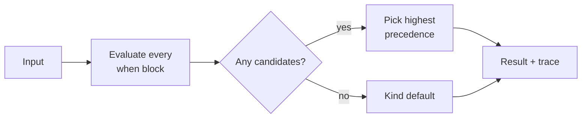

# Sigil

A small, statically typed policy language for Go hosts.


[](https://pkg.go.dev/github.com/spechtlabs/sigil)
[](https://codecov.io/gh/SpechtLabs/sigil)

**Documentation:** [sigil.specht-labs.de](https://sigil.specht-labs.de/) &nbsp;·&nbsp; **Where it stands:** [roadmap](./roadmap.yml) and [open questions](./docs/project/open-questions.md)

Sigil is a small language for decision logic. Your Go program hands a policy typed input, the policy's rules look at it, and the answer is a typed decision: page the on-call, turn a feature on, approve a deploy, grant a role. Every decision carries a reason and a payload, and every policy is type-checked against a contract your Go code defines. The language terminates on finite inputs when its host functions terminate. It ships as an importable Go library, in the spirit of [filt-rs](https://github.com/SierraSoftworks/filters), and it's meant to replace the YAML rule engines with label-selector matchers that teams keep rebuilding.

> [!IMPORTANT]
> The language, the Go API, composition and the CLI are implemented, and fuzz tests cover every layer. Not built yet: loading a kind from a file at run time (`policy.LoadKind`), host-ordered types such as versions, static cost budgets, and editor tooling. The [roadmap](#roadmap) tracks what's left.

## What it looks like

The example routes alerts: for each firing alert, the policy decides whether to page the on-call, drop the alert or post it to the team's channel.

**The kind** is the contract, defined in Go. Tagged structs are the input a policy reads, and each decision lists the reasons it may give and the payload the host acts on:

```go
type Input struct {
	Alert Alert `policy:"alert"` // name, severity, labels, firing_for
	Team  Team  `policy:"team"`  // name, oncall, channel
}

var (
	Page   = policy.NewDecision[PageData]("page", "critical_alert", "sustained")
	Drop   = policy.NewDecision[policy.None]("drop", "muted", "not_production")
	Notify = policy.NewDecision[NotifyData]("notify", "routine", "unrouted")
)

var Kind = policy.NewKind[Input]("AlertRouting",
	policy.WithVersion(1),
	policy.WithEnum(Critical, Warning, Info),
	policy.WithDecisions(Page, Drop, Notify), // a page beats a drop beats a notification
	policy.WithDefault(Notify.Reason("unrouted")),
	// ...
)
```

**A policy** is a set of `when` blocks. Every rule is evaluated, each decision it reaches becomes a candidate, and the kind's precedence picks the winner:

```sigil
policy checkout.alerts: AlertRouting@1

let pre_production = alert.labels["env"] in ["staging", "dev"]

when not pre_production and alert.severity == critical {
  page(reason: critical_alert, target: team.oncall)
}

when not pre_production and alert.severity == warning {
  when alert.firing_for >= 30m {
    page(reason: sustained, target: team.oncall)
  }

  notify(reason: routine, channel: team.channel)
}

when pre_production {
  drop(reason: not_production)
}
```

`critical` and `warning` are values of the kind's `Severity` enum, so `alert.severity == critcal` is a compile error, not a rule that never matches. The same goes for a misspelled field, a duration compared with a number, or a reason the kind doesn't declare.

**The host** compiles the policy once and evaluates it per alert:

```go
p, err := Kind.Load(policies, "checkout.alerts")
if err != nil {
	log.Fatal(err) // file:line:col plus a fix hint
}

res, err := p.Eval(ctx, Input{Alert: alert, Team: team})
if page, ok := Page.Match(res); ok {
	pageOncall(page.Target, res.Reason) // page is a typed PageData
}
```

A warning that has fired for 45 minutes matches two rules, and the page wins:

```text
$ sigil eval --input latency.json
checkout.alerts: page(reason: sustained)
  target = "checkout-primary"

trace: 2 candidates
  * page(reason: sustained)  checkout/alerts.sigil:11:5
      when not pre_production and alert.severity == warning
       and alert.firing_for >= 30m
      target = "checkout-primary"
    notify(reason: routine)  checkout/alerts.sigil:14:3
      channel = "#checkout-alerts"
```

**Sharing rules.** When several teams write policies against one kind, a platform team publishes modules of named expressions and policies with typed params, and each team invokes them with its own values. The host can require the rules no team may switch off:

```sigil
policy payments.alerts: AlertRouting@1

use platform.paging
use platform.routing

paging(page_after: 5m)   // required by the host, bounded by the platform
routing()
```

Nothing about the language is specific to alerts. The same constructs decide feature rollouts, discounts, deploy approvals or the roles someone holds. Two complete services show it:

- [`examples/alert-routing/`](./examples/alert-routing) is the router above, grown into a TypeScript service on Sigil's WebAssembly build: a Next.js app that takes Alertmanager webhooks, with an operator console, hot reload, metrics, traces, a Grafana dashboard and a k6 load test suite. `mise run -C examples/alert-routing up` starts it.
- [`examples/deploy-gates/`](./examples/deploy-gates) is deploygate, a deploy approval service with two kinds: one decides whether a deploy goes ahead, and a collecting kind grants the roles each deploy is checked with.

## Design goals

- **Readable on first contact.** Terse is fine; Rego-style logic programming isn't.
- **Finite and halting by design.** No loops, no recursion, no user-defined functions. Quantifiers and filters range over finite collections. Host functions must terminate; static cost budgets are still planned.
- **Typed against the host's contract.** Unknown fields, misspelled enum values, type mismatches and wrong payload keys fail at compile time. A typo can't silently switch a deny rule off.
- **Self-describing decisions.** A mandatory, literal reason on every decision, plus a typed payload the host acts on.
- **Composable from day one.** Typed `param`s, `use` imports and policy invocation replace text templating for per-team variants, and `sigil explain` flattens any composition back into the rules it adds up to.
- **Parse once, evaluate many.** A compiled policy is immutable and safe for concurrent use.

Out of scope: general computation, reimplementations of the evaluator in other languages, and org-wide authorization in the style of OPA or Cedar. Sigil targets decisions embedded in a single application.

**Other languages.** Hosts outside Go run the same engine compiled to WebAssembly, so a policy decides the same everywhere. [`bindings/typescript`](./bindings/typescript) wraps it for TypeScript and JavaScript and is published to npm as [`@spechtlabs/sigil`](https://www.npmjs.com/package/@spechtlabs/sigil). [`bindings/rust`](./bindings/rust) wraps it for Rust on wasmtime, with hard deadlines from epoch interruption and a pool of instances, and is published to crates.io as [`spechtlabs-sigil`](https://crates.io/crates/spechtlabs-sigil). See [Embed Sigil in TypeScript](./docs/guides/embed-typescript.md), [Embed Sigil in Rust](./docs/guides/embed-rust.md) and [the WebAssembly module](./docs/reference/wasm.md).

## How evaluation works

Every `when` block is evaluated, independently and in no particular order. Each decision constructor reached becomes a candidate, and the candidate whose decision ranks highest in the kind's `precedence` wins. If nothing fires, the kind's `default` applies. Rule order never changes the outcome: candidates of the same decision rank by the reasons the kind declares, equal ones fold into one, and a contradiction the kind hasn't ranked is a conflict error rather than a pick by position. There's no `else`: `when not x` says the same thing without implying order.


```mermaid
flowchart LR
  A[Input] --> B[Evaluate every<br/>when block]
  B --> C{Any candidates?}
  C -- yes --> D[Pick highest<br/>precedence]
  C -- no --> E[Kind default]
  D --> F[Result + trace]
  E --> F
```

The host gets back the winning decision, its reason and payload, the name of the policy it evaluated, and a trace of every candidate, each with the policy and position of the constructor that produced it. An invoked policy's rules join the same pool, with the conditions of any `when` around the call added to each of them.

## Prior art

| Project | What Sigil takes | What it avoids |
| --- | --- | --- |
| [filt-rs](https://github.com/SierraSoftworks/filters) | Friendly expression syntax, `in`/`like`/`contains`, durations, parse once / eval many, errors with a fix hint | Unknown properties resolving to `null`, which makes deny rules fail open |
| [Cedar](https://www.cedarpolicy.com/) | Schema-checked policies, forbid overrides permit, templates with slots | A principal/action/resource model too narrow for arbitrary host inputs |
| [CEL](https://github.com/google/cel-go) | Non-Turing-complete by construction, planned static cost estimation, host-declared variables and functions | Being an expression language only, with no rules, decisions or composition |
| [Rego (OPA)](https://www.openpolicyagent.org/docs/latest/policy-language/) | The lesson about learning curves | Datalog semantics, implicit iteration, partial rule sets |
| HCL / YAML DSLs | The declarative feel | Nesting that fights templating, anchors as reuse, stringly typed matchers |

## Install

The library is a Go module; hosts import `github.com/spechtlabs/sigil/pkg/policy`:

```sh
go get github.com/spechtlabs/sigil@latest
```

Install the `sigil` CLI with Homebrew from the [Specht Labs tap](https://github.com/SpechtLabs/homebrew-tap):

```sh
brew install --cask spechtlabs/tap/sigil
```

Or install it with Go:

```sh
go install github.com/spechtlabs/sigil/cmd/sigil@latest
```

Prebuilt archives for Linux and macOS on amd64 and arm64 are also available from the [releases](https://github.com/SpechtLabs/sigil/releases).

The stock binary checks, formats and explains any policy, but it has only the signatures of the kind's host functions, so `eval` and `test` stop at the first call to one. A host builds its own CLI with the real functions linked in through [`pkg/cli`](./docs/guides/host-binary.md); the example service's [`sigilc`](./examples/deploy-gates/cmd/sigilc) is one.

Every release after v0.1.0 signs `checksums.txt` with a keyless [cosign](https://docs.sigstore.dev/) signature from the release workflow. Verify the checksums, then the archive against them:

```sh
cosign verify-blob checksums.txt \
  --bundle checksums.txt.sigstore.json \
  --certificate-identity https://github.com/SpechtLabs/sigil/.github/workflows/release.yaml@refs/heads/main \
  --certificate-oidc-issuer https://token.actions.githubusercontent.com
sha256sum --ignore-missing -c checksums.txt
```

## Documentation

The docs site is at [sigil.specht-labs.de](https://sigil.specht-labs.de/), built from [`docs/`](./docs). Where to start depends on what you're doing:

| You want to | Start with |
| --- | --- |
| Write and test policies | [What Sigil is](./docs/getting-started/overview.md), [the tour](./docs/getting-started/tour.md) and the [step-by-step path](./docs/getting-started/define-the-input.md), then the [guides](./docs/guides/team-policies.md), [testing your policies](./docs/guides/test-policies.md) and the [language reference](./docs/reference/policy-files.md) |
| Embed Sigil in a Go service | [Embedding Sigil in a Go service](./docs/guides/embed-go.md), the [Go API reference](./docs/reference/go-api.md), [the example service](./docs/guides/example-service.md), [policies in a ConfigMap](./docs/guides/configmaps.md) and [evolving a kind](./docs/guides/evolve-a-kind.md) |
| Embed Sigil in TypeScript | [Embed Sigil in TypeScript](./docs/guides/embed-typescript.md) and the [WebAssembly module reference](./docs/reference/wasm.md) |
| Embed Sigil in Rust | [Embed Sigil in Rust](./docs/guides/embed-rust.md) and the [WebAssembly module reference](./docs/reference/wasm.md) |
| Decide whether Sigil fits | [What Sigil is](./docs/getting-started/overview.md), the [design goals](./docs/understanding/design-goals.md) and the other understanding pages, and [prior art](./docs/understanding/prior-art.md) |
| Change Sigil itself | [Contributing](./docs/project/contributing.md), the [open questions](./docs/project/open-questions.md) and the [roadmap](./roadmap.yml) |

To run the site locally you need [mise](https://mise.jdx.dev/), which installs the pinned toolchain:

```bash
mise install
mise run docs-dev
```

## Roadmap

M1 to M6 are done. Hardening is in progress: fuzz targets and round-trip properties cover every layer, and a weekly campaign fuzzes each of the 33 targets for an hour. Public `LoadKind`, a day-long fuzz campaign and static cost analysis remain. Editor tooling comes last.

| Milestone | Scope | State |
| --- | --- | --- |
| M1 Language specification | Reference, grammar, rationale, answers to the syntax-affecting open questions | Done |
| M2 Expressions | Lexer, Pratt parser, AST with positions, error hints | Done |
| M3 Types | `NewKind` reflection, type checker, evaluator over Go structs | Done |
| M4 Policies | `when`, decision constructors, precedence, default, trace; host-ordered types remain | Done |
| M5 Composition | `param`, `let`, modules and imports, policy invocation, `Require`, bundle loader, cycle detection, `sigil explain` | Done |
| M6 Tooling I | `sigil fmt`, kind export, `sigil check` with lints, `sigil eval`, `sigil test`, `policytest` | Done |
| M7 Hardening | Round-trip properties, fuzzing across layers and a weekly hour-per-target campaign; public `LoadKind`, a day-long campaign and cost analysis remain | In progress |
| M8 Tooling II | `sigil lsp`, `sigil gen go`, `sigil breaking`; the commands exist but aren't implemented | Planned |

The roadmap lives in [`roadmap.yml`](./roadmap.yml) in the [roadmap-md](https://roadmap.sierrasoftworks.com/) format, with every deliverable and what "done" means for each milestone; open it in the [roadmap viewer](https://roadmap.sierrasoftworks.com/viewer/github.com#SpechtLabs/sigil) for the rendered version.

## Contributing

Run `mise run test` for the race-enabled test suite, `mise run fuzz` for ten seconds of mutation fuzzing per target, starting from the shared corpus on the `fuzz-corpus` branch, and `mise run check` for the repository checks. Use `mise run bench -- --baseline main` to compare performance with a base revision. CI fails statistically significant regressions above 10% in time or allocations. See [Contributing](./docs/project/contributing.md) for targeted runs, regression inputs and benchmark workloads.

Coverage per package, from the CI test run; each ring is a directory level, sized by lines and colored by coverage:

[](https://codecov.io/gh/SpechtLabs/sigil)

Bug reports and design challenges are both welcome: a policy that reads badly, an error message that doesn't point at the fix, a semantic corner the [reference](./docs/reference/policy-files.md) doesn't cover, or an answer to one of the [open questions](./docs/project/open-questions.md). Open an [issue](https://github.com/SpechtLabs/sigil/issues), ideally with the policy and input that show the problem, or send a pull request. Contributions are accepted under the project's license, as section 5 of the Apache License describes.

## License

Sigil is licensed under the [Apache License 2.0](./LICENSE). Copyright 2026 SpechtLabs.
