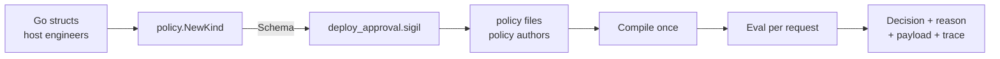

Sigil is a small, statically typed policy language that you embed in a Go application. Engineers write rules that read host-provided input and produce a typed decision such as `approve`, `deny` or `review`. Every decision carries a reason and a payload, so the host always knows what was decided, why, and with which parameters.

::: info Design phase
Nothing is implemented yet. These pages are the specification, written before the first line of the parser. If an example here looks wrong, surprising or hard to read, that's exactly the feedback the design needs: [open an issue](https://github.com/SpechtLabs/sigil/issues).
:::

## The problem it replaces

Most applications that make access or approval decisions grow a rule engine by accident. It usually starts as a YAML file with a list of rules, each rule a label selector plus an outcome. Then someone needs "any of these roles", so a new matcher type appears. Then a team needs its own version of the file, so the YAML goes through `text/template`. Then a typo in a field name makes one deny rule silently match nothing, and nobody notices until an audit.

Sigil takes that recurring pile of matchers and turns it into a language with a type checker. A typo like `service.teir` fails when the policy compiles, not months later. Per-team versions are ordinary policies that bind typed parameters, so no text templating is involved. And the result of every evaluation says which rule fired and why.

## What a setup looks like

A working setup has three parts. The example used throughout these docs is a gate for production deploys: the platform team decides who may ship what, and product teams tune it for their services.

The three parts:

| Part | Written by | What it is |
| --- | --- | --- |
| The kind (`deploy_approval.sigil`) | Generated from Go | The contract: which inputs exist, their types, which host functions policies may call, which decisions they may make, and how conflicts resolve |
| A base policy (`deploy/production.sigil`) | A platform team | Rules written against the kind, with typed `param`s for the parts teams may tune |
| An instantiation (`payments/production.sigil`) | A product team, here payments | A policy that `use`s the base, binds its params, and optionally adds rules of its own |

Two rules from the base policy give a feel for the syntax:

```sigil
when not eligible {
  deny("not_eligible")
}

when release.soak < min_soak and not release.hotfix {
  deny("soak_too_short")
}
```

Every statement starts with a keyword, rules are `when` blocks, and decisions are constructor calls with a string-literal reason. There are no loops, no user-defined functions and no `else`.

## Who writes what

Host engineers own the Go side. They describe the input as Go structs, declare the decisions and their payloads, and call `policy.NewKind`. The kind exports itself as a `.sigil` file that starts with the `kind` keyword, and that file is what everyone else works against.

Policy authors never touch Go. They write policy files (also `.sigil`, starting with the `policy` keyword), check them against the exported kind file, and ship test cases next to them. Tooling (the `sigil` CLI and its LSP server) reads the kind file too, so a policy repo lints in CI without importing the host's code.



The host compiles each policy once and evaluates it for every request, from as many goroutines as it likes. A compiled policy is immutable.

## What it isn't

Sigil isn't a general-purpose language and it isn't meant to replace OPA or Cedar for org-wide authorization. It targets decisions that live inside one application, where the host already has the data in Go structs. For now only Go can evaluate policies; other languages can read the exported kind file and type-check against it, but not run it.

Policy and kind files share the `.sigil` extension, and the CLI is called `sigil`. The remaining naming questions are in the [open questions](/project/open-questions/).

## Where to go next

- [A tour of the language](/getting-started/tour/) walks through a complete example and evaluates a few inputs by hand.
- [Your first policy](/getting-started/first-policy/) builds that example from an empty file.
- [Design goals](/understanding/design-goals/) explains the constraints behind the syntax.
- The [language reference](/reference/policy-files/) is the precise version of everything above.
