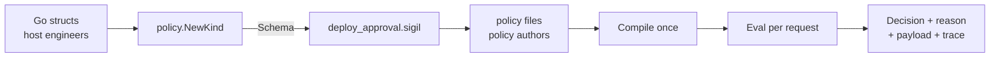

Sigil is a small, statically typed policy language that you embed in a Go application. Engineers write rules that read host-provided input and produce a typed decision such as `approve`, `deny` or `review`. Every decision carries a reason and a payload, so the host always knows what was decided, why, and with which parameters.

This page is the starting point for everyone: people who write policies, Go developers who embed Sigil in a service, and anyone deciding whether it fits. [Where to go next](#where-to-go-next) splits the paths.

::: info Project status
The language, the Go API, composition and the CLI are implemented, and fuzz tests cover every layer. Not built yet: loading a kind from a file at run time (`policy.LoadKind`), host-ordered types such as versions, static cost budgets, and editor tooling. The [roadmap](/project/roadmap/) tracks what's left. The language can still change; report problems through [GitHub issues](https://github.com/SpechtLabs/sigil/issues).
:::

## The problem it replaces

Most applications that make access or approval decisions grow a rule engine by accident. It usually starts as a YAML file with a list of rules, each rule a label selector plus an outcome. Then someone needs "any of these roles", so a new matcher type appears. Then a team needs its own version of the file, so the YAML goes through `text/template`. Then a typo in a field name makes one deny rule silently match nothing, and nobody notices until an audit.

Sigil takes that recurring pile of matchers and turns it into a language with a type checker. A typo like `service.teir` fails when the policy compiles, not months later. Per-team versions are ordinary policies that bind typed parameters, so no text templating is involved. And the result of every evaluation says which rule fired and why.

## What a setup looks like

A working setup has three parts. The example used throughout these docs is a gate for production deploys: the platform team decides who may ship what, and product teams tune it for their services.

The three parts:

| Part | Written by | What it is |
| --- | --- | --- |
| The kind (`deploy_approval.sigil`) | Generated from Go | The contract: which inputs exist, their types, which host functions policies may call, which decisions they may make, and how conflicts resolve |
| Shared policies (`deploy/*.sigil`) | A platform team | Rules written against the kind, with typed `param`s for the parts teams may tune: guardrails that deny, approvals and reviews, and a module of shared matchers |
| A team policy (`payments/production.sigil`) | A product team, here payments | A policy that invokes the shared ones with its own values, optionally under conditions, and adds rules of its own |

Two rules from the platform's guardrails give a feel for the syntax:

```sigil
when not eligible {
  deny(not_eligible)
}

when release.soak < min_soak and not release.hotfix {
  deny(soak_too_short)
}
```

Declarations start with keywords, rules are `when` blocks, and decision constructors name a reason declared in the kind. There are no loops, no user-defined functions and no `else`. A team policy reuses these rules by importing the policy with `use` and invoking it like a constructor, `guardrails(min_soak: 4h)`. The host can require that call so no team can switch the denies off.

## Who writes what

Host engineers own the Go side. They describe the input as Go structs, declare the decisions and their payloads, and call `policy.NewKind`. The kind exports itself as a `.sigil` file that starts with the `kind` keyword, and that file is what everyone else works against.

Policy authors write `.sigil` policy files, check them against the exported kind file, and ship test cases next to them. The `sigil` CLI reads the kind file, so a policy repo lints in CI without importing the host's code. LSP support is planned.


```mermaid
flowchart LR
  A[Go structs<br/>host engineers] --> B[policy.NewKind]
  B -- Schema --> C[deploy_approval.sigil]
  C --> D[policy files<br/>policy authors]
  D --> E[Compile once]
  E --> F[Eval per request]
  F --> G[Decision + reason<br/>+ payload + trace]
```

The host compiles each policy once and evaluates it for every request, from as many goroutines as it likes. A compiled policy is immutable.

## What it isn't

Sigil isn't a general-purpose language and it isn't meant to replace OPA or Cedar for org-wide authorization. It targets decisions that live inside one application, where the host already has the data in Go structs. For now only a Go program can embed the evaluator. The exported kind file is plain text with a [published grammar](/reference/grammar/), so tooling in other languages can read it, but nothing outside Go runs policies yet.

Policy and kind files share the `.sigil` extension, and the CLI is called `sigil`.

## Install

Policy authors need the `sigil` CLI, not Go. Install it with Homebrew:

```sh
brew install --cask spechtlabs/tap/sigil
```

Or, if you have Go, with `go install github.com/spechtlabs/sigil/cmd/sigil@latest`. The [releases](https://github.com/SpechtLabs/sigil/releases) also have signed archives for Linux and macOS.

The stock binary knows each host function's signature from the kind file, but not its implementation. `check`, `fmt` and `explain` work on any policy. `eval` and `test` work until a rule calls a host function, such as the deploy kind's `split`, and then stop with a runtime error naming it. For those, use the host team's own build of the CLI, which links in the real functions through package `cli`; the [example service](/guides/example-service/) builds one as `sigilc`. [Host functions and host binaries](/reference/cli/#host-functions-and-host-binaries) has the details.

Host engineers add the library to their module with `go get github.com/spechtlabs/sigil@latest` and import `github.com/spechtlabs/sigil/pkg/policy`.

## Where to go next

It depends on what you're here to do.

- **Writing policies.** [A tour of the language](/getting-started/tour/) walks through a complete example and evaluates a few inputs by hand, and [Your first policy](/getting-started/first-policy/) builds it from an empty file, tests included. After that, the [guides](/guides/team-policies/) cover per-team policies and common patterns, and the [language reference](/reference/policy-files/) is the precise version of everything above.
- **Embedding Sigil in a Go service.** [Embed Sigil in a Go service](/guides/embed-go/) takes you from Go structs to a typed decision, and the [Go API reference](/reference/go-api/) lists every function, option and type. [The example service](/guides/example-service/) is a complete host you can run, and [Policies in a ConfigMap](/guides/configmaps/) and [Evolve a kind safely](/guides/evolve-a-kind/) cover running one in production.
- **Deciding whether Sigil fits.** [Design goals](/understanding/design-goals/) explains the constraints behind the syntax, and [Prior art](/understanding/prior-art/) says what Sigil takes from filt-rs, Cedar, CEL and Rego, and what it avoids.
- **Changing Sigil itself.** [Contributing](/project/contributing/) explains the test suite, benchmarks and fuzz campaigns, and the [open questions](/project/open-questions/) list what's still undecided.
