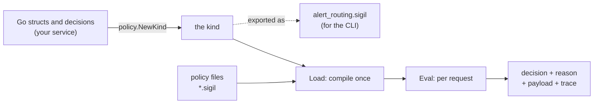

Sigil is a small language for writing rules. Your Go program hands a policy some typed input, the policy's rules look at it, and the answer is a typed decision: page the on-call, turn a feature on, approve a deploy, grant a role, apply a discount. Every decision carries a reason and the data the program needs to act on it.

A policy that routes alerts reads like this:

```sigil
policy checkout.alerts: AlertRouting@1

when alert.severity == critical {
  page(reason: critical_alert, target: team.oncall)
}

when alert.severity == warning {
  notify(reason: routine, channel: team.channel)
}
```

`when` blocks are rules. `page(...)` and `notify(...)` are decisions, and the decisions a policy may make, their reasons and their fields are fixed by a contract your Go code defines, called the **kind**. A typo in a field, a misspelled severity or a missing payload field is a compile error, not a rule that quietly never matches.

::: info Project status
The language, the Go API, composition and the CLI are implemented, and fuzz tests cover every layer. Not built yet: loading a kind from a file at run time (`policy.LoadKind`), host-ordered types such as versions, static cost budgets, and editor tooling. The [roadmap](/project/roadmap/) tracks what's left. The language can still change; report problems through [GitHub issues](https://github.com/SpechtLabs/sigil/issues).
:::

## What you can decide with it

Sigil doesn't know what an alert, a deploy or a discount is. The kind says what the input looks like and which decisions exist, and the language only evaluates rules against it. The same few constructs cover very different problems:

::: tabs

@tab Alert routing

The running example of these docs. Page someone, post to a channel, or drop the alert:

```sigil
decision page   { reason: critical_alert | sustained  target: string }
decision drop   { reason: muted | not_production }
decision notify { reason: routine | unrouted          channel: string = "#alerts" }
```

```sigil
when alert.severity == warning and alert.firing_for >= 30m {
  page(reason: sustained, target: team.oncall)
}

when alert.name in ["CheckoutCanaryLatency"] {
  drop(reason: muted)
}
```

@tab Feature rollout

Turn a feature on for enterprise customers, beta testers and a percentage of everyone else, but only in regions where it's ready:

```sigil
policy flags.new_checkout: FeatureRollout@1

param percent: int = 20, min: 0, max: 100

when user.region not in ["eu-1", "eu-2"] {
  disable(reason: region_not_ready)
}

when user.beta {
  enable(reason: beta_tester, variant: "redesign")
}

when bucket < percent {
  enable(reason: rollout)
}
```

@tab Discounts

Decide which discount applies to a cart. The kind ranks the reasons, so a loyal customer's 20% wins over the first-order 10%:

```sigil
policy shop.discounts: Discount@1

when customer.orders == 0 {
  discount(reason: first_order, percent: 10)
}

when cart.items >= 10 and cart.total >= 100.0 {
  discount(reason: bulk, percent: 15)
}

when customer.tier in [gold, platinum] {
  discount(reason: loyalty, percent: 20)
}
```

@tab Deploy approval

Approve a release, send it to review, or deny it. [Per-team policies](/guides/team-policies/) builds the full version:

```sigil
when release.soak < min_soak and not release.hotfix {
  deny(reason: soak_too_short)
}

when service.tier in tiers and actor.teams any in service.owners {
  review(reason: service_owner, approvers: approvers)
}
```

@tab Access grants

A kind can collect every decision that holds instead of picking one, here the roles someone holds at once:

```sigil
when team_member {
  reader(reason: team_member)
  deployer(reason: team_member)
}

when on_call {
  deployer(reason: oncall, ttl: 2h)
}
```

:::

The first three are small enough to write in an afternoon. The last two come from [deploygate](/guides/example-service/), a complete service that uses both kinds.

## How it fits together


```mermaid
flowchart LR
  G["Go structs and decisions<br/>(your service)"] -- policy.NewKind --> K["the kind"]
  K -. exported as .-> F["alert_routing.sigil<br/>(for the CLI)"]
  P["policy files<br/>*.sigil"] --> L["Load: compile once"]
  K --> L
  L --> E["Eval: per request"]
  E --> D["decision + reason<br/>+ payload + trace"]
```

- **The kind** is Go code. You describe the input as structs, declare the decisions with their reasons and payloads, and say which decision wins when several rules fire. Nobody writes a kind by hand.
- **Policies** are `.sigil` files written against the kind. They can live in the service's repository, in a separate one, or in a ConfigMap.
- **Your service** compiles the policies once and evaluates them for every request, from as many goroutines as it likes. A compiled policy is immutable.
- **The `sigil` CLI** checks, evaluates and tests policies without your Go code. It reads the kind from a file your service exports.

The evaluator doesn't loop, recurse or call anything the kind doesn't declare, so a policy always halts. Rule order never matters: every rule is evaluated, and the kind's precedence picks the winner. [Design goals](/understanding/design-goals/) explains why.

## What it isn't

Sigil isn't a general-purpose language, and it isn't meant to replace OPA or Cedar for org-wide authorization. It's for decisions that live inside one application. Go programs embed it natively; programs in other languages run the same engine compiled to WebAssembly, as [Embed Sigil in TypeScript](/guides/embed-typescript/) shows.

## Install

The Go library:

```sh
go get github.com/spechtlabs/sigil@latest
```

The `sigil` CLI, for checking and testing policies. People who only write policies need the CLI, not Go:

```sh
brew install --cask spechtlabs/tap/sigil
```

Or `go install github.com/spechtlabs/sigil/cmd/sigil@latest`. The [releases](https://github.com/SpechtLabs/sigil/releases) also have signed archives for Linux and macOS.

## Learn it step by step

The [tour](/getting-started/tour/) reads one complete policy in five minutes and lets you route alerts through it in the browser. After that, these steps build the alert router from an empty Go module. Each one adds one idea:

::: steps

1. [Define the input and evaluate a policy](/getting-started/define-the-input/)

   Describe the input and the decisions in Go, load one policy and act on its decision.

2. [Write policies](/getting-started/write-policies/)

   Rules, lets, nesting, precedence and the compile errors that catch mistakes.

3. [Export the kind](/getting-started/export-the-kind/)

   Write the contract to a file, so policies can be checked without your Go code.

4. [Check, evaluate and test with the CLI](/getting-started/check-and-test/)

   `sigil check`, `sigil eval` and test files that pin the decisions.

5. [Share rules across teams](/getting-started/share-rules/)

   A library of shared helpers and policies that teams invoke with their own values.

6. [See what a policy adds up to](/getting-started/explain/)

   `sigil explain` flattens a composed policy into the rules it can fire.

7. [Require guardrails](/getting-started/require-guardrails/)

   Rules the host requires of every policy, so no team can switch them off.

:::

Steps 1 to 4 are all a service needs when one team owns its policies. Steps 5 to 7 are for when several teams write policies against the same kind.
