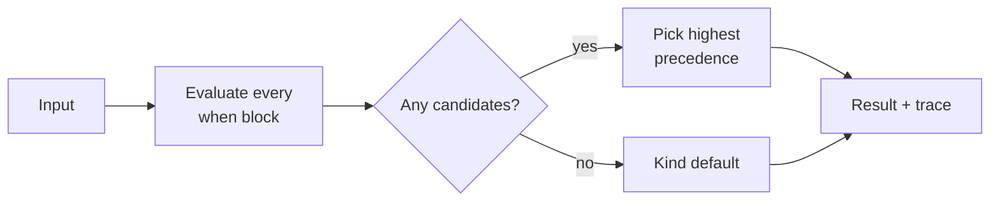

::: info Draft specification
This page specifies the language as designed. Nothing is implemented yet; see [Open questions](/project/open-questions/).
:::

Evaluation takes a compiled policy and one input value and produces exactly one decision. The rules on this page are the whole algorithm. For why it works this way, read [Why rule order never matters](/understanding/order-independence/).



## The rules

1. Every top-level `when` block is evaluated, independently and in no particular order. That includes the blocks brought in by `use`.
2. A nested `when` fires only if its own condition and every enclosing condition hold. Nesting is conjunction: `when a { when b { ... } }` behaves like `when a and b { ... }`.
3. Each decision constructor reached in a firing block becomes a candidate carrying its decision name, reason, payload, source position and policy.
4. The winner is the candidate whose decision ranks highest in the kind's `precedence`.
5. If several candidates share the winning decision, the one with the earliest source position wins. Rules from `use`d policies count as earlier than the file's own rules.
6. If there are no candidates at all, the result is the kind's `default`.

There's no `else`, no early return and no fall-through. `when not x` expresses the negative case without implying an order between blocks.

Rule order in a file doesn't change which decision wins. It can only matter in rule 5, when two candidates of the same decision carry different payloads.

### Ordering for ties

Rule 5 needs a total order over source positions across files. The proposed order is a depth-first walk of the policy:

- `use` statements come before the file's own rules.
- Several `use` statements are ordered by their position in the using file.
- Inside one file, candidates are ordered by line and column of the constructor.

::: tip Proposed
The current design says used policies count as earlier but doesn't order several `use` statements against each other. The depth-first walk above is proposed. Replacing positional tie-breaking with merge functions declared in the kind, such as the minimum `bake` or the union of `approvers`, is an [open question](/project/open-questions/).
:::

## Example

Take `payments.production`, which uses `deploy.production` and adds one approval:

```sigil
policy payments.production: DeployApproval

use deploy.production(
  min_soak: 4h,
  approvers: ["payments-leads"],
)

when "payments-sre" in actor.teams {
  approve("payments_sre", bake: 15m)
}
```

Take an otherwise eligible deploy of a release that has soaked for `2h`, not marked as a hotfix, by a member of `payments-sre`. Two blocks fire: `deploy.production`'s `soak_too_short` deny, since `2h < 4h`, and the team's `payments_sre` approve. With `precedence deny > review > approve` the deny wins. The trace still lists both candidates.

For the same person deploying a release that has soaked for `6h`, to a `standard` service owned by another team, only the team rule fires and the result is `approve("payments_sre", bake: 15m)`.

## Composition

`use` adds the used policy's rules to the candidate pool and nothing else. No rule can remove, override or suppress another rule's candidate. Combined with precedence, a decision a base policy makes explicitly can never be downgraded by a policy that uses it. The kind's default isn't protected the same way: a team rule can turn a no-match default deny into an approve. See [Composition without templating](/understanding/composition/).

## Lets

A `let` has no side effects and host functions are pure, so when a let gets evaluated is unobservable except through runtime errors.

::: tip Proposed
Lets are evaluated lazily, at most once per evaluation, on first use. A let that no firing path reaches never runs, so it can't raise a runtime error.
:::

## Determinism

The same compiled policy and the same input always produce the same result, trace included. The language has no clock, no randomness and no access to the environment. If a rule needs the current time, the host passes it in as an input of type `timestamp`. Replay testing and audit reconstruction only need the input that was evaluated.

Host functions must be pure for this to hold. The language can't check that; it's the host's contract.

## Runtime errors

Static typing removes most failure modes. What's left:

| Error                   | Example                                             |
| ----------------------- | --------------------------------------------------- |
| List index out of range | `actor.roles[5]` on a list of three                 |
| Integer overflow        | `int` or `duration` arithmetic that leaves 64 bits  |
| Host function error     | a bound Go function returns a non-nil `error`       |

A missing map key isn't an error; it yields the zero value. An absent optional isn't an error either, because the compiler already forced a `??`.

A runtime error anywhere aborts the evaluation. `Eval` returns the error together with a result holding the kind's default decision, so a host that fails closed can use the result directly. Since every block is evaluated, the outcome doesn't depend on block order: an input that triggers a runtime error always does.

Work skipped by short-circuiting (`and`, `or`, `??`, quantifiers stopping early, a `when` whose condition is false) never runs and can't raise an error.

## Halting and cost

Evaluation always terminates:

- There are no loops. Quantifiers iterate over finite input lists.
- There's no recursion. `let` bindings and `use` imports must form a DAG, and cycles are compile errors.
- There are no user-defined functions. Host functions are declared in the kind and must be pure.
- `matches` uses Go's RE2 engine, which runs in linear time.

Evaluation cost grows with policy size times input size. Given a host-declared maximum collection size, the compiler computes a static worst-case cost per policy, as CEL does, and a host can reject policies over a budget. `sigil check` reports the figure; see [CLI & editor tooling](/reference/cli/).

A quantifier nested inside another quantifier multiplies the collection sizes, so the worst case for two nested quantifiers over lists of size `n` is `n²`. The static estimate accounts for that.

::: warning Unspecified
How the budget is expressed, where the maximum collection size gets declared, and what a host function costs are all open. See [Halting by construction](/understanding/halting/) for the reasoning and [Open questions](/project/open-questions/) for what's undecided.
:::

## Concurrency

A compiled policy is immutable. Any number of goroutines may evaluate it at the same time, and replacing a policy at runtime is a pointer swap. See the [Go API](/reference/go-api/).
