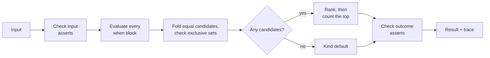

The algorithm that turns a compiled policy and one input into an outcome, and what each failure returns.

A `collect one` kind produces exactly one decision. A [collecting kind](#collecting-kinds) produces every decision that fired, or every one at the top rank. Asserts check the input before any rule runs, and the outcome once it exists. Why: [Why rule order never matters](/understanding/order-independence/).


```mermaid
flowchart LR
  A[Input] --> I[Check input<br/>asserts]
  I --> B[Evaluate every<br/>when block]
  B --> X[Fold equal candidates,<br/>check exclusive sets]
  X --> C{Any candidates?}
  C -- yes --> D[Rank, then<br/>count the top]
  C -- no --> E[Kind default]
  D --> O[Check outcome<br/>asserts]
  E --> O
  O --> F[Result + trace]
```

## The rules

1. Every top-level `when` block is evaluated, independently and in no particular order. That includes the blocks brought in by [policy invocations](#invocation), each with its call's enclosing conditions added.
2. A nested `when` fires only if its own condition and every enclosing condition hold. Nesting is conjunction: `when a { when b { ... } }` behaves like `when a and b { ... }`.
3. Each decision constructor reached in a firing block becomes a candidate carrying its decision name, reason, payload, source position, policy and call chain.
4. The candidates are resolved into the outcome, as [Resolution](#resolution) describes.
5. If there are no candidates at all, the outcome is the kind's `default`, or empty for a collecting kind that declares none.

- Input asserts run before rule 1 and outcome asserts after rule 4; see [Assertions](#assertions).
- There's no `else`, no early return and no fall-through. `when not x` expresses the negative case.
- Rule order in a file never changes the outcome. Nothing in resolution reads a position; positions only appear in the trace and in error messages.

## Resolution

Resolution runs in four steps. None of them looks at where a candidate came from.

1. **Fold.** Candidates with the same decision, reason and payload are one outcome. Two branches that both say `deny(reason: soak_too_short)`, or a policy invoked twice with the same params, produce one candidate here. The trace still lists every constructor that fired.
2. **Check `exclusive` sets.** If candidates remain from two members of one [`exclusive`](/reference/kind-files/#exclusive) set, the evaluation fails with a conflict, whatever else fired.
3. **Rank.** Candidates are ordered by their decision's position in `precedence`, then by their reason's position in the decision's scoped `precedence` when it has one. The top rank is the highest-ranked decision that has a candidate, narrowed to its highest-ranked reason when its reasons are ranked; unranked reasons of that decision share the top rank. Without `precedence`, in a `collect all` kind, every candidate is at the top rank.
4. **Count.** What's left at the top rank is the outcome. A `collect all` kind returns all of it. A `collect one` kind returns it when it's one candidate, and fails with a conflict when it's more: two candidates with the same decision and reason but different payloads, or two reasons the kind didn't rank.

A conflict fails the evaluation with a `*ConflictError`; see [Failed evaluations](#failed-evaluations) for the result. The error's `Candidates` hold only the side that conflicts: every candidate of the `exclusive` set's members, or every candidate at the top rank.

Resolution never merges, changes or invents a candidate. Why: [Decisions and reasons](/understanding/decisions/).

## Collecting kinds

A kind that declares [`collect all`](/reference/kind-files/#collect) has no winner. Rules 1 to 3 are unchanged, and resolution ends differently:

| Kind                           | Outcome                                                                  |
| ------------------------------ | ------------------------------------------------------------------------ |
| `collect all`                  | Every candidate left after the fold and the `exclusive` check            |
| `collect all` with `precedence` | Every candidate at the top rank. If the top decision ranks its reasons, only the candidates with the highest-ranked reason that fired |
| No candidates                  | The kind's `default` if it declares one, empty otherwise                 |

- The outcome is sorted by the kind's declaration order of decisions, then by reason rank if the decision ranks its reasons, then by source position. The sort only fixes the order the host reads the candidates in.
- A `collect all` kind with `precedence deny > review > approve` returns every `review` that fired when no `deny` did, so two reviews with different approvers both reach the host.
- Candidates aren't merged. If `admin` fires from two branches with different `ttl` payloads, the host gets both.
- The result's single `Decision`, `Reason` and `Payload` fields stay empty; see [Result](/reference/go-api/#result).

```sigil
policy access.engineering: AccessGrant@1

use access.guardrails

guardrails()

when "engineering" in actor.groups {
  read(reason: engineering_member)
}

when "platform" in actor.groups {
  write(reason: platform_member)
  development_environment_writer(reason: platform_member)
}
```

For a member of both groups, the outcome is `read(reason: engineering_member)`, `write(reason: platform_member)` and `development_environment_writer(reason: platform_member)`, in that order.

## Assertions

An [`assert`](/reference/policy-files/#assert) is checked as soon as what it reads is ready. The checker sorts every assert into one of two groups by its condition alone:

| Group          | Condition                    | Reads                                  |
| -------------- | ---------------------------- | -------------------------------------- |
| Input assert   | doesn't read `outcome`       | the input, params and lets             |
| Outcome assert | reads `outcome`              | the outcome, once it exists            |

`when` conditions and lets can't read `outcome`, so nothing else makes an assert depend on the outcome. There's no keyword to pick the group.

Why asserts run in two phases, and when to use one instead of a deny: [Asserts and decisions](/understanding/asserts/).

Evaluation runs in three phases:

1. **Input asserts.** Every input assert whose enclosing conditions all hold is checked, independently and in no particular order. If any fails, the evaluation fails here and no rule runs.
2. **Rules.** Every block is evaluated and the outcome is picked or collected, as above. If a rule raises a [runtime error](#runtime-errors), or resolution ends in a [conflict](#resolution), the evaluation fails here and there's no outcome to check.
3. **Outcome asserts.** Every outcome assert whose enclosing conditions all hold is checked, the same way. If any fails, the evaluation fails.

- In every phase, asserts reached through invocations are included, with their call's enclosing conditions added, as for decisions.
- An assert whose condition or enclosing conditions raise a runtime error counts as failed, and its failure carries the runtime error.
- `outcome` is the whole root's outcome, also for an assert in an invoked policy. With [`outcome.<decision>`](/reference/expressions/#candidates) an assert reads the candidates' payloads too.
- Every failing assert of the phase is reported, sorted by source position.
- A failed phase ends the evaluation. A failed input assert hides outcome asserts.

A failed assert fails the evaluation with an `*AssertionError`; see [Failed evaluations](#failed-evaluations) for the result. Its `Phase` is `InputAsserts` or `OutcomeAsserts`, and its `Failures` hold one entry per failing assert; the fields are in [Errors](/reference/go-api/#errors). Its `Error()` names the failing assert and the call chain that reached it, here a guardrail invoked on line 5 of `access.main`:

```text
assertion "sod_customer_dev" failed at access/main.sigil:5:1 → platform/access/guardrails.sigil:3:1
```

Some details of assertions are still open; see [Assertions](/project/open-questions/#assertions).

## Invocation

An invocation adds the invoked policy's rules to the candidate pool, with the enclosing conditions of the call added to every rule. It's rule 2 again: nesting is conjunction. So this call in `payments.production`:

```sigil
when service.labels["compliance"] != "pci" {
  production(approvers: ["payments-leads"])
}
```

behaves exactly as if `deploy.production`'s rules were pasted inside the block, with `approvers` and `tiers` replaced by their bound values:

```sigil
when service.labels["compliance"] != "pci" {
  when cleared {
    when service.tier == critical
      and "release_manager" in actor.roles {
      approve(reason: release_manager)
    }

    when service.tier in [standard, internal]
      and owns_service {
      review(reason: service_owner, approvers: ["payments-leads"])
    }
  }
}
```

- All candidates are collected, precedence picks the winner, and rule order doesn't matter.
- An invocation at the top level has no enclosing conditions, so its rules run exactly as they would in the invoked file.
- No rule can remove, override or suppress another rule's candidate.
- An invocation inside `when` only contributes while the enclosing conditions hold. `when false { guardrails() }` switches off every deny in `guardrails`. [Required policies](#required-policies) rule that out for the policies the host names.
- The kind's default isn't protected: a team rule can turn a no-match default deny into an approve.
- A policy invoked twice is instantiated twice. Each instance has its own params, and each candidate records the call chain it came from, for example `payments/production.sigil:14:3 → deploy/production.sigil:16:5`.
- [`sigil explain`](/reference/cli/#sigil-explain) prints the flattened view for a whole policy.

Why: [Composition without templating](/understanding/composition/).

## Required policies

The host names the policies every root policy must invoke unconditionally, with `policy.Require` when it loads a policy (see [Load options](/reference/go-api/#load-options)); `sigil check` runs the same check for the policies `--require` or the `require` key of [the configuration file](/reference/config/) names.

- Each required policy must be reachable from the root through top-level invocations only, with no `when` anywhere on the path. Otherwise the load fails, with an error at the gated call, or at the root's header when the call is missing.
- The requirement is transitive. A shared baseline policy that invokes `deploy.guardrails` at its top level satisfies it for every policy that invokes the baseline at its top level, at any depth.
- Every candidate a required policy produces is in the candidate set on every evaluation, so a required policy's deny can never be outranked.
- A required policy's top-level asserts are checked on every evaluation.
- The requirement names a policy, and policies resolve by name, not by file path; see [Name resolution](/reference/bundles/#name-resolution). Without `policy.From`, the check proves that some policy with that name is invoked, not which one. [Trusted sources](/reference/bundles/#trusted-sources) has the rules for `policy.From`.
- `Require` takes no bounds. A required policy bounds its own params with [`min` and `max`](/reference/policy-files/#bounds): with `param min_soak: duration = 24h, min: 1h`, a team that binds `min_soak` can tighten the soak but not loosen it below an hour. Lists such as `approvers` have no bounds.

```text
payments/production.sigil:10:3: error: deploy.guardrails must be invoked unconditionally
   |
10 |   guardrails(min_soak: 4h)
   |   ^^^^^^^^^^^^^^^^^^^^^^^^
   = help: the host requires deploy.guardrails for every DeployApproval policy; move the call to the top level
```

Why protection is explicit: [Composition without templating](/understanding/composition/).

## Lets

- Lets are evaluated lazily, on first use, and at most once per evaluation in each policy instance. A policy invoked twice evaluates its lets once per instance.
- A let that no firing path reaches never runs, so it can't raise a runtime error.
- A [scoped let](/reference/policy-files/#scoped-lets) can only be used inside its `when` body, so it only runs when every enclosing condition holds.
- A `let` has no side effects and host functions are pure, so when a let is evaluated is unobservable except through runtime errors.

## Determinism

- The same compiled policy and the same input always produce the same result, trace included, so replaying an evaluation, for tests or an audit, only needs the input that was evaluated.
- The language has no clock, no randomness and no access to the environment. A rule that needs the current time reads it from an input of type `timestamp` that the host passes in.
- Host functions must be pure for this to hold. The language can't check that; it's the host's contract.

## Runtime errors

| Error                   | Example                                                                                                                                                                |
| ----------------------- | ---------------------------------------------------------------------------------------------------------------------------------------------------------------------- |
| List index out of range | `actor.roles[5]` on a list of three                                                                                                                                    |
| Integer overflow        | `int` or `duration` arithmetic that leaves 64 bits                                                                                                                     |
| Value outside its enum  | a rule reads `service.tier` and the host passed `Tier("critcal")`; see [Enums](/reference/go-api/#enums)                                                               |
| Host function error     | a bound Go function returns a non-nil `error`                                                                                                                          |
| Recovered host panic    | a host function panics in a kind declared with [`policy.WithRecoverHostPanics()`](/reference/go-api/#kind-options); the message names the function and the panic value |
| Unbound host function   | the stock `sigil` CLI reaches a call to a host function it has no implementation for                                                                                   |

Not errors:

- A missing map key yields the zero value.
- A host value outside its enum that no rule reads. The check happens on the read, for each value a list, map key or optional holds.
- An absent optional can't be read without `??`, which the compiler enforces.
- Without `WithRecoverHostPanics`, a host function's panic isn't recovered: it propagates out of `Eval` and crashes the calling goroutine unless the host recovers it. Host functions report a failure by returning an error.

A runtime error in a rule, whether in a `when` condition, a payload or a let either of them reads, fails the evaluation with a `*RuntimeError` (fields in [Errors](/reference/go-api/#errors)); see [Failed evaluations](#failed-evaluations) for the result.

- It happens after the input asserts have passed, so it never hides a failing input assert.
- A runtime error inside an assert is that assert's failure; see [Assertions](#assertions).
- Every block is evaluated, so an input that triggers a runtime error always does, whatever the block order.
- Work skipped by short-circuiting (`and`, `or`, `??`, quantifiers stopping early, a `when` whose condition is false) never runs and can't raise an error.

## Failed evaluations

Every way an evaluation can fail returns an error together with a result the host can act on:

| What failed                          | Error             | Outcome, `collect one` | Outcome, `collect all` | Trace            |
| ------------------------------------ | ----------------- | ---------------------- | ---------------------- | ---------------- |
| An input assert                      | `*AssertionError` | the kind's default     | empty                  | empty            |
| A runtime error in the rules         | `*RuntimeError`   | the kind's default     | empty                  | empty            |
| Resolution                           | `*ConflictError`  | the kind's `conflict` outcome, or its default | empty           | every candidate  |
| An outcome assert                    | `*AssertionError` | the kind's default     | empty                  | every candidate  |
| The context was done                 | `ctx.Err()`       | the kind's default     | empty                  | empty            |

- The two assert rows return the same error type. The error's `Phase` field, `InputAsserts` or `OutcomeAsserts`, tells them apart: the first rejects the input, the second is a defect in the policy.
- An outcome assert that fails when no rule fired leaves the trace empty, like a failed input assert.
- A `collect one` kind returns its [`conflict`](/reference/kind-files/#conflict) outcome only after a conflict, and only when it declares one; every other failure returns the default.
- The `collect all` outcome is empty even when the kind declares a default.
- After a conflict, a runtime error or a failed input assert, outcome asserts don't run.

Why every failure falls back to the default, and when a kind names its conflicts: [Strict schema, forgiving data](/understanding/strictness/#every-failure-fails-closed). To act on failures in a host, see [Handle failed evaluations](/guides/handle-errors/).

### Context checks

`Eval` checks the context:

- before it starts,
- before every rule and assert,
- after every host function call, and
- every few hundred elements that a quantifier, filter, membership test, list operator or `has` goes through.

Once the context is done, the evaluation stops at the next check and returns the context's error, unwrapped, so `errors.Is(err, context.DeadlineExceeded)` holds.

- The trace is empty even when rules had fired before the check.
- A cancellation is never an assert's failure; it stops an assert phase the same way.
- `Eval` can't interrupt a host function that never returns.
- A deadline limits how long one evaluation takes, not the work an input asks for: a slow input uses the CPU until the deadline.

To set a deadline, see [Bound evaluation time](/guides/handle-errors/#bound-evaluation-time). Why evaluation terminates: [Halting by construction](/understanding/halting/).

::: warning Planned
[Static cost analysis](/project/planned/#static-cost-analysis): the compiler doesn't compute or enforce a budget yet.
:::
