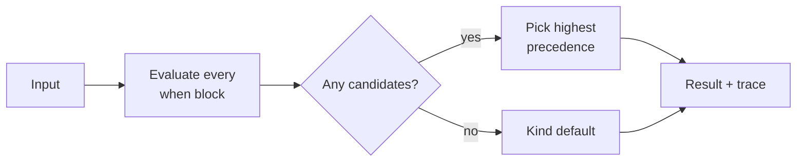

::: info Draft specification
This page specifies the language as designed. The lexer and parser implement the syntax and kinds are implemented; type checking and evaluation aren't yet. See [Open questions](/project/open-questions/).
:::

Evaluation takes a compiled policy and one input value and produces an outcome: exactly one decision for a kind with `precedence`, and every decision that fired for a [collecting kind](#collecting-kinds). Asserts then check the outcome and the input. The rules on this page are the whole algorithm. For why it works this way, read [Why rule order never matters](/understanding/order-independence/).


```mermaid
flowchart LR
  A[Input] --> B[Evaluate every<br/>when block]
  B --> C{Any candidates?}
  C -- yes --> D[Pick highest<br/>precedence]
  C -- no --> E[Kind default]
  D --> F[Result + trace]
  E --> F
```

## The rules

1. Every top-level `when` block is evaluated, independently and in no particular order. That includes the blocks brought in by [policy invocations](#invocation), each with its call's enclosing conditions added.
2. A nested `when` fires only if its own condition and every enclosing condition hold. Nesting is conjunction: `when a { when b { ... } }` behaves like `when a and b { ... }`.
3. Each decision constructor reached in a firing block becomes a candidate carrying its decision name, reason, payload, source position, policy and call chain.
4. The winner is the candidate whose decision ranks highest in the kind's `precedence`.
5. If several candidates share the winning decision, the one with the earliest source position wins. For a rule reached through an invocation, the position is its call site first, then its position in the invoked file.
6. If there are no candidates at all, the result is the kind's `default`.

Rules 4 to 6 apply to kinds with `precedence`. A collecting kind replaces them; see [Collecting kinds](#collecting-kinds). Asserts run after the outcome is known; see [Assertions](#assertions).

There's no `else`, no early return and no fall-through. `when not x` expresses the negative case without implying an order between blocks.

Rule order in a file doesn't change which decision wins. It can only matter in rule 5, when two candidates of the same decision carry different payloads.

### Ordering for ties

Rule 5 needs a total order over source positions across files. A candidate's position is the list of positions along its call chain: the call site in the evaluated file, then the call site in the invoked file if that one invokes further, and finally the constructor itself. Two positions compare element by element, by line and then column, like strings compare character by character.

So a policy invoked on line 7 contributes candidates that all sort before a constructor on line 18 of the same file, and after one on line 3. Where a call sits in the file decides where its rules sort, which is what a reader scanning the file would expect.

::: tip Proposed
Comparing whole call chains element by element is proposed here; the design only fixes that the call site comes first and the callee position second. Replacing positional tie-breaking with merge functions declared in the kind, such as the minimum `bake` or the union of `approvers`, is an [open question](/project/open-questions/).
:::

## Collecting kinds

A kind that declares [`collect all`](/reference/kind-files/#collect) has no winner. Rules 1 to 3 are unchanged, and the rest change:

- In place of rule 4, the outcome is every candidate, sorted by the kind's declaration order of decisions, then by source position as in [Ordering for ties](#ordering-for-ties).
- In place of rule 5, candidates aren't merged or deduplicated. If `admin` fires from two branches with different `ttl` payloads, the host gets both and decides what two grants of the same role mean.
- In place of rule 6, if there are no candidates, the outcome is the kind's `default` if it declares one, and empty otherwise.

Nothing is picked, so nothing is tie-broken, and rule order has no effect at all: the sort only fixes the order the host reads the candidates in. The one place order leaks in a kind with `precedence` doesn't exist here.

```sigil
policy access.engineering: AccessGrant

use access.guardrails

guardrails()

when "engineering" in actor.groups {
  read("engineering_member")
}

when "platform" in actor.groups {
  write("platform_member")
  development_environment_writer("platform_member")
}
```

For a member of both groups, the outcome is `read("engineering_member")`, `write("platform_member")` and `development_environment_writer("platform_member")`, in that order. The body under `"platform"` holds two constructors, which a collecting kind makes natural; whether that's allowed is still [open](/project/open-questions/#multiple-decisions-per-block).

::: tip Proposed
Collecting kinds, their ordering and the empty outcome are proposed. See [Open questions](/project/open-questions/#collecting-kinds).
:::

## Assertions

An [`assert`](/reference/policy-files/#assert) is checked after the outcome is known, so its condition can read `outcome` along with the input:

1. Every block is evaluated and the outcome is picked or collected, as above.
2. Every assert whose enclosing conditions all hold is checked, independently and in no particular order. Asserts reached through invocations are included, with their call's enclosing conditions added, exactly as for decisions.
3. If any assert's condition is false, the evaluation fails with an assertion error.

`outcome` is the whole root's outcome, including an assert in an invoked policy. That's what lets a required guardrail policy check what every other policy in the composition granted. It also means an assert can fail because of a rule in a policy it has never seen, which is the point.

Every failing assert is reported, sorted by source position, not just the first one found. Stopping at the first failure would make the error depend on evaluation order.

When an assert fails, `Eval` returns an assertion error and a result whose outcome is the kind's `default` for a kind with `precedence`, and empty for a collecting kind. The host never sees a partial outcome it could act on by mistake. The trace still lists every candidate, and the error names each failing assert by reason and call chain. For an assert over `outcome`, it also names the candidates that made it fail:

```text
error: assertion "sod_customer_dev" failed
  granted customer_data_writer            at teams/data.sigil:12:5
  granted development_environment_writer  at teams/data.sigil:4:1 → access/dev.sigil:30:3
```

The layout is illustrative; the exact format isn't fixed yet.

Asserts and decisions answer different questions. A decision is an outcome the author expected and the host acts on, such as denying a deploy that hasn't soaked. A failed assert means something is wrong with the policy, the host or the input, and it should reach whoever owns the evaluation as an error. An assert that input from a caller can trip lets that caller fill the host's error metrics, so keep those rare and make them mean it.

::: tip Proposed
Assertions are proposed. The open parts are listed under [Assertions](/project/open-questions/#assertions).
:::

## Invocation

An invocation inside `when` blocks adds the enclosing conditions to every rule of the invoked policy. It's rule 2 again: nesting is conjunction. So this call in `payments.production`:

```sigil
when service.labels["compliance"] != "pci" {
  production(approvers: ["payments-leads"])
}
```

behaves exactly as if `deploy.production`'s rules were pasted inside the block, with `approvers` and `tiers` replaced by their bound values:

```sigil
when service.labels["compliance"] != "pci" {
  when cleared {
    when service.tier == "critical"
      and "release_manager" in actor.roles {
      approve("release_manager")
    }

    when service.tier in ["standard", "internal"]
      and owns_service {
      review("service_owner", approvers: ["payments-leads"])
    }
  }
}
```

Everything else still holds: all candidates are collected, precedence picks the winner, and rule order doesn't matter. An invocation at the top level has no enclosing conditions, so its rules run exactly as they would in the invoked file. [`sigil explain`](/reference/cli/#sigil-explain) prints this flattened view for a whole policy.

A policy invoked twice is instantiated twice. Each instance has its own params, and each candidate records the call chain it came from, for example `payments/production.sigil:14:3 → deploy/production.sigil:16:5`, so the trace tells the instances apart.

## Example

Take `payments.production`, which invokes `deploy.guardrails` and `deploy.production` and adds one approval:

```sigil
policy payments.production: DeployApproval

use deploy.guardrails
use deploy.production
use deploy.common.{cleared}

guardrails(min_soak: 4h)

when service.labels["compliance"] == "pci" {
  production(approvers: ["payments-leads", "security-leads"])
}

when service.labels["compliance"] != "pci" {
  production(approvers: ["payments-leads"])
}

when cleared and "payments-sre" in actor.teams {
  approve("payments_sre", bake: 15m)
}
```

Take an otherwise eligible deploy of a release that has soaked for `2h`, not marked as a hotfix, by a cleared member of `payments-sre`. Two blocks fire: `deploy.guardrails`'s `soak_too_short` deny, since `2h < 4h`, and the team's `payments_sre` approve. With `precedence deny > review > approve` the deny wins. The trace still lists both candidates.

For the same person deploying a release that has soaked for `6h`, to a `standard` service without a `compliance` label, owned by another team, only the team rule fires and the result is `approve("payments_sre", bake: 15m)`.

## Composition

An invocation adds the invoked policy's rules to the candidate pool and nothing else. No rule can remove, override or suppress another rule's candidate, and precedence decides between them. What an invocation's caller does control is when those rules apply: an invocation inside `when` only contributes while the enclosing conditions hold. `when false { guardrails() }` switches off every deny in `guardrails`, and a real condition does the same in subtler ways.

The kind's default isn't protected either: a team rule can turn a no-match default deny into an approve. See [Composition without templating](/understanding/composition/).

### Required policies

The host closes the gap that gating opens. It names the policies every root policy must invoke unconditionally, with `policy.Require` when it loads a policy (see the [Go API](/reference/go-api/#required-policies)). The compiler checks that each required policy is reachable from the root through top-level invocations only, with no `when` anywhere on the path. A gated call fails the build:

```text
payments/production.sigil:10:3: error: deploy.guardrails must be invoked unconditionally
   |
 9 | when service.labels["compliance"] == "pci" {
10 |   guardrails(min_soak: 4h)
   |   ^^^^^^^^^^^^^^^^^^^^^^^^
   = help: the host requires deploy.guardrails for every DeployApproval policy.
           Move the call to the top level.
```

Every candidate a required policy produces is then always in the candidate set, so a required policy's deny can never be outranked. The same holds for its top-level asserts: they're checked on every evaluation. In a collecting kind, where nothing outranks anything, a required policy's asserts are the only guardrail there is. Protection is explicit: the host decides which policies are guardrails, instead of every composed policy being protected implicitly.

The requirement names a policy, and policies are found by the name in their header, not by file path (see [Bundles and resolution](/reference/policy-files/#bundles-and-resolution)). On its own, the check proves that some policy called `deploy.guardrails` is invoked, not which one. `policy.From` pins a required policy, and everything it imports, to a source the host trusts, and makes a bundle document that claims one of those names a compile error. See [Where required policies come from](/reference/go-api/#where-required-policies-come-from).

Params are still outside the guarantee. A team binds `min_soak` when it invokes `guardrails`, so it can loosen it. Letting a required policy bound its params is an [open question](/project/open-questions/), and so is whether a requirement may be met through a chain of other policies rather than directly in the root file.

## Lets

A `let` has no side effects and host functions are pure, so when a let gets evaluated is unobservable except through runtime errors.

::: tip Proposed
Lets are evaluated lazily, at most once per evaluation, on first use. A let that no firing path reaches never runs, so it can't raise a runtime error.
:::

## Determinism

The same compiled policy and the same input always produce the same result, trace included. The language has no clock, no randomness and no access to the environment. If a rule needs the current time, the host passes it in as an input of type `timestamp`. Replay testing and audit reconstruction only need the input that was evaluated.

Host functions must be pure for this to hold. The language can't check that; it's the host's contract.

## Runtime errors

Static typing removes most failure modes. What's left:

| Error                   | Example                                             |
| ----------------------- | --------------------------------------------------- |
| List index out of range | `actor.roles[5]` on a list of three                 |
| Integer overflow        | `int` or `duration` arithmetic that leaves 64 bits  |
| Host function error     | a bound Go function returns a non-nil `error`       |

A missing map key isn't an error; it yields the zero value. An absent optional isn't an error either, because the compiler already forced a `??`.

A runtime error anywhere aborts the evaluation. `Eval` returns the error together with a result holding the kind's default decision, so a host that fails closed can use the result directly. For a collecting kind the result's outcome is empty, even if the kind declares a default, because a default grant on an error would fail open. (proposed)

A runtime error takes priority over failed asserts: once one occurs, `Eval` returns it and doesn't report asserts. An assert whose own condition raises a runtime error reports that runtime error. Since every block is evaluated, the outcome doesn't depend on block order: an input that triggers a runtime error always does.

Work skipped by short-circuiting (`and`, `or`, `??`, quantifiers stopping early, a `when` whose condition is false) never runs and can't raise an error.

## Halting and cost

Evaluation always terminates:

- There are no loops. Quantifiers iterate over finite input lists.
- There's no recursion. `let` bindings, imports and policy invocations must each form a DAG, and cycles are compile errors.
- There are no user-defined functions. Host functions are declared in the kind and must be pure.
- `matches` uses Go's RE2 engine, which runs in linear time.

Evaluation cost grows with policy size times input size. Given a host-declared maximum collection size, the compiler computes a static worst-case cost per policy, as CEL does, and a host can reject policies over a budget. `sigil check` reports the figure; see [CLI & editor tooling](/reference/cli/).

A quantifier nested inside another quantifier multiplies the collection sizes, so the worst case for two nested quantifiers over lists of size `n` is `n²`. The static estimate accounts for that.

::: warning Unspecified
How the budget is expressed, where the maximum collection size gets declared, and what a host function costs are all open. See [Halting by construction](/understanding/halting/) for the reasoning and [Open questions](/project/open-questions/) for what's undecided.
:::

## Concurrency

A compiled policy is immutable. Any number of goroutines may evaluate it at the same time, and replacing a policy at runtime is a pointer swap. See the [Go API](/reference/go-api/).
