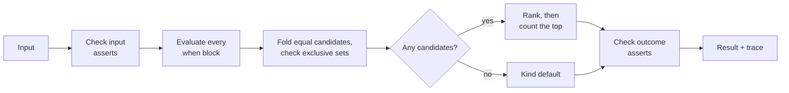

Evaluation takes a compiled policy and one input value and produces an outcome: exactly one decision for a `collect one` kind, and every decision that fired, or every one at the top rank, for a [collecting kind](#collecting-kinds). Asserts check the input before any rule runs, and the outcome once it exists. The rules on this page are the whole algorithm, so a policy author can predict any outcome from them and a host knows what each failure returns. For why it works this way, read [Why rule order never matters](/understanding/order-independence/).


```mermaid
flowchart LR
  A[Input] --> I[Check input<br/>asserts]
  I --> B[Evaluate every<br/>when block]
  B --> X[Fold equal candidates,<br/>check exclusive sets]
  X --> C{Any candidates?}
  C -- yes --> D[Rank, then<br/>count the top]
  C -- no --> E[Kind default]
  D --> O[Check outcome<br/>asserts]
  E --> O
  O --> F[Result + trace]
```

## The rules

1. Every top-level `when` block is evaluated, independently and in no particular order. That includes the blocks brought in by [policy invocations](#invocation), each with its call's enclosing conditions added.
2. A nested `when` fires only if its own condition and every enclosing condition hold. Nesting is conjunction: `when a { when b { ... } }` behaves like `when a and b { ... }`.
3. Each decision constructor reached in a firing block becomes a candidate carrying its decision name, reason, payload, source position, policy and call chain.
4. The candidates are resolved into the outcome, as [Resolution](#resolution) describes: equal candidates fold into one, `exclusive` sets are checked, the candidates are ranked, and the top rank is what the host gets.
5. If there are no candidates at all, the outcome is the kind's `default`, or empty for a collecting kind that declares none.

Input asserts run before rule 1 and outcome asserts after rule 4; see [Assertions](#assertions).

There's no `else`, no early return and no fall-through. `when not x` expresses the negative case without implying an order between blocks.

Rule order in a file never changes the outcome. Nothing in resolution reads a position; positions only appear in the trace and in error messages.

## Resolution

Resolution turns the candidates into what the host gets back. It runs in four steps, and none of them looks at where a candidate came from.

1. **Fold.** Candidates with the same decision, reason and payload are one outcome. Two branches that both say `deny(soak_too_short)`, or a policy invoked twice with the same params, produce one candidate here. The trace still lists every constructor that fired.
2. **Check `exclusive` sets.** If candidates remain from two members of one [`exclusive`](/reference/kind-files/#exclusive) set, the evaluation fails with a conflict, whatever else fired. A contradiction between two rules is a defect in the policy, and no ranking hides it.
3. **Rank.** Candidates are ordered by their decision's position in `precedence`, then by their reason's position in the decision's scoped `precedence` when it has one. The top rank is the highest-ranked decision that has a candidate, narrowed to its highest-ranked reason when its reasons are ranked; unranked reasons of that decision share the top rank. Without `precedence`, in a `collect all` kind, every candidate is at the top rank.
4. **Count.** What's left at the top rank is the outcome. A `collect all` kind returns all of it. A `collect one` kind returns it when it's one candidate, and fails with a conflict when it's more: two candidates with the same decision and reason but different payloads, or two reasons the kind didn't rank.

A conflict makes `Eval` return a `*ConflictError` with a result holding the kind's default for `collect one` and an empty outcome for `collect all`, the same shape a failed assert returns. The error's `Candidates` are the ones that conflict: every candidate of the `exclusive` set's members, or every candidate at the top rank. The result's trace lists every candidate. Outcome asserts don't run, because there's no outcome for them to check.

The design goal behind these steps is that no candidate is ever merged, changed or invented. What the host gets is always something a rule produced, with its reason and position intact, and the only questions the language answers are which candidates count and whether they can stand together. Anything else, such as taking the shortest `bake` of two approvals, is the host's decision over `MatchAll`, in code that can be tested.

## Collecting kinds

A kind that declares [`collect all`](/reference/kind-files/#collect) has no winner. Rules 1 to 3 are unchanged, and resolution ends differently:

- Without `precedence`, every candidate left after the fold and the `exclusive` check is the outcome, sorted by the kind's declaration order of decisions, then by reason rank if the decision ranks its reasons, then by source position. The sort only fixes the order the host reads the candidates in.
- With `precedence`, every candidate at the top rank is the outcome, in the same order. A `collect all` kind with `precedence deny > review > approve` returns every `review` that fired when no `deny` did, so two reviews with different approvers both reach the host. If the kind also ranks `review`'s reasons, only the candidates with the highest-ranked reason that fired are returned.
- Candidates aren't merged. If `admin` fires from two branches with different `ttl` payloads, the host gets both and decides what two grants of the same role mean.
- If there are no candidates, the outcome is the kind's `default` if it declares one, and empty otherwise.

```sigil
policy access.engineering: AccessGrant@1

use access.guardrails

guardrails()

when "engineering" in actor.groups {
  read(engineering_member)
}

when "platform" in actor.groups {
  write(platform_member)
  development_environment_writer(platform_member)
}
```

For a member of both groups, the outcome is `read(engineering_member)`, `write(platform_member)` and `development_environment_writer(platform_member)`, in that order. The body under `"platform"` holds two constructors, which a collecting kind makes natural.

## Assertions

An [`assert`](/reference/policy-files/#assert) is checked as soon as what it reads is ready. The checker sorts every assert into one of two groups by its condition alone:

- An **input assert** doesn't read `outcome`. It checks the input, params and lets, which are all known before any rule runs.
- An **outcome assert** reads `outcome`. It can only be checked once the outcome exists.

Nothing else can make an assert depend on the outcome, because `when` conditions and lets can't read `outcome`. There's no keyword to pick the group: it would repeat what the checker already sees, and the only group that makes sense for an assert is the earliest one it can run in.

Evaluation then runs in three phases:

1. **Input asserts.** Every input assert whose enclosing conditions all hold is checked, independently and in no particular order. If any fails, the evaluation fails here and no rule runs.
2. **Rules.** Every block is evaluated and the outcome is picked or collected, as above. If a rule raises a [runtime error](#runtime-errors), or resolution ends in a [conflict](#resolution), the evaluation fails here and there's no outcome to check.
3. **Outcome asserts.** Every outcome assert whose enclosing conditions all hold is checked, the same way. If any fails, the evaluation fails.

In every phase, asserts reached through invocations are included, with their call's enclosing conditions added, exactly as for decisions. An assert whose condition or enclosing conditions raise a runtime error counts as failed, and its failure carries the runtime error.

Checking input asserts first is what makes them useful as preconditions. With `assert("critical_needs_team_label", service.labels has "team")` in place, an input without the label fails with that reason. Without it, a rule reading `service.labels["team"]` would get `""` from the missing key and decide on it, and a rule indexing a list the input left short would fail with a bare index error. It also means no rule and no host function call runs on input the policy has declared invalid.

`outcome` is the whole root's outcome, including an assert in an invoked policy. That's what lets a required guardrail policy check what every other policy in the composition granted. With [`outcome.<decision>`](/reference/expressions/#candidates) it can check what they carry too, such as the approvers of every review. It also means an assert can fail because of a rule in a policy it has never seen, which is the point.

Every failing assert of the phase is reported, sorted by source position, not just the first one found. Stopping at the first failure would make the error depend on evaluation order. A phase that fails ends the evaluation, so a failed input assert hides outcome asserts, which never get an outcome to check.

When an assert fails, `Eval` returns an `*AssertionError` and a result whose outcome is the kind's `default` for `collect one`, and empty for `collect all`. The host never sees a partial outcome it could act on by mistake. The result's trace lists every candidate the rules produced, none if an input assert failed. The error's `Failures` hold one `AssertFailure` per failing assert, with its `Reason`, `Policy`, `Position` and `CallChain`. For an outcome assert, `Outcome` lists the candidates that formed the outcome it read, and for an assert that raised a runtime error, `Cause` holds that error. With a single failure, the error reads:

```text
assertion "sod_customer_dev" failed at platform/access/guardrails.sigil:3:1
```

Asserts and decisions answer different questions. A decision is an outcome the author expected and the host acts on, such as denying a deploy that hasn't soaked. A failed assert means something is wrong with the policy, the host or the input, and it should reach whoever owns the evaluation as an error. An assert that input from a caller can trip lets that caller fill the host's error metrics, so keep those rare and make them mean it.

Some details of assertions are still open; see [Assertions](/project/open-questions/#assertions).

## Invocation

An invocation inside `when` blocks adds the enclosing conditions to every rule of the invoked policy. It's rule 2 again: nesting is conjunction. So this call in `payments.production`:

```sigil
when service.labels["compliance"] != "pci" {
  production(approvers: ["payments-leads"])
}
```

behaves exactly as if `deploy.production`'s rules were pasted inside the block, with `approvers` and `tiers` replaced by their bound values:

```sigil
when service.labels["compliance"] != "pci" {
  when cleared {
    when service.tier == "critical"
      and "release_manager" in actor.roles {
      approve(release_manager)
    }

    when service.tier in ["standard", "internal"]
      and owns_service {
      review(service_owner, approvers: ["payments-leads"])
    }
  }
}
```

Everything else still holds: all candidates are collected, precedence picks the winner, and rule order doesn't matter. An invocation at the top level has no enclosing conditions, so its rules run exactly as they would in the invoked file. [`sigil explain`](/reference/cli/#sigil-explain) prints this flattened view for a whole policy.

A policy invoked twice is instantiated twice. Each instance has its own params, and each candidate records the call chain it came from, for example `payments/production.sigil:14:3 → deploy/production.sigil:16:5`, so the trace tells the instances apart.

## Example

Take `payments.production`, which invokes `deploy.guardrails` and `deploy.production` and adds one approval:

```sigil
policy payments.production: DeployApproval@1

use deploy.guardrails
use deploy.production
use deploy.common.{cleared}

guardrails(min_soak: 4h)

when service.labels["compliance"] == "pci" {
  production(approvers: ["payments-leads", "security-leads"])
}

when service.labels["compliance"] != "pci" {
  production(approvers: ["payments-leads"])
}

when cleared and "payments-sre" in actor.teams {
  approve(payments_sre, bake: 15m)
}
```

Take an otherwise eligible deploy of a release that has soaked for `2h`, not marked as a hotfix, by a cleared member of `payments-sre`. Two blocks fire: `deploy.guardrails`'s `soak_too_short` deny, since `2h < 4h`, and the team's `payments_sre` approve. With `precedence deny > review > approve` the deny wins. The trace still lists both candidates.

For the same person deploying a release that has soaked for `6h`, to a `standard` service without a `compliance` label, owned by another team, only the team rule fires and the result is `approve(payments_sre, bake: 15m)`.

## Composition

An invocation adds the invoked policy's rules to the candidate pool and nothing else. No rule can remove, override or suppress another rule's candidate, and precedence decides between them. What an invocation's caller does control is when those rules apply: an invocation inside `when` only contributes while the enclosing conditions hold. `when false { guardrails() }` switches off every deny in `guardrails`, and a real condition does the same in subtler ways.

The kind's default isn't protected either: a team rule can turn a no-match default deny into an approve. See [Composition without templating](/understanding/composition/).

### Required policies

The host closes the gap that gating opens. It names the policies every root policy must invoke unconditionally, with `policy.Require` when it loads a policy (see the [Go API](/reference/go-api/#required-policies)). The compiler checks that each required policy is reachable from the root through top-level invocations only, with no `when` anywhere on the path. A gated call fails the build:

```text
payments/production.sigil:10:3: error: deploy.guardrails must be invoked unconditionally
   |
10 |   guardrails(min_soak: 4h)
   |   ^^^^^^^^^^^^^^^^^^^^^^^^
   = help: the host requires deploy.guardrails for every DeployApproval policy; move the call to the top level
```

Every candidate a required policy produces is then always in the candidate set, so a required policy's deny can never be outranked. The same holds for its top-level asserts: they're checked on every evaluation. In a collecting kind, where nothing outranks anything, a required policy's asserts are the only guardrail there is. Protection is explicit: the host decides which policies are guardrails, instead of every composed policy being protected implicitly.

The requirement names a policy, and policies are found by the name in their header, not by file path (see [Bundles and resolution](/reference/policy-files/#bundles-and-resolution)). On its own, the check proves that some policy called `deploy.guardrails` is invoked, not which one. `policy.From` pins a required policy, and everything it imports, to a source the host trusts, and makes a bundle document that claims one of those names a compile error. See [Where required policies come from](/reference/go-api/#where-required-policies-come-from).

Params are covered by [bounds](/reference/policy-files/#bounds). A team binds `min_soak` when it invokes `guardrails`, and with `param min_soak: duration = 24h, min: 1h` it can tighten the soak but not loosen it below an hour. Lists such as `approvers` have no bounds. A requirement may be met through a chain of top-level invocations, not only by a call in the root file; see [Required policies](/reference/go-api/#required-policies).

## Lets

A `let` has no side effects and host functions are pure, so when a let gets evaluated is unobservable except through runtime errors.

Lets are evaluated lazily, on first use, and at most once per evaluation in each policy instance: a policy invoked twice evaluates its lets once per instance, since their params can differ. A let that no firing path reaches never runs, so it can't raise a runtime error. A [scoped let](/reference/policy-files/#scoped-lets) can only be used inside its `when` body, so it only runs when every enclosing condition holds: the guard around it is guaranteed by the language, not by the author remembering where the let is used.

## Determinism

The same compiled policy and the same input always produce the same result, trace included. The language has no clock, no randomness and no access to the environment. If a rule needs the current time, the host passes it in as an input of type `timestamp`. Replay testing and audit reconstruction only need the input that was evaluated.

Host functions must be pure for this to hold. The language can't check that; it's the host's contract.

## Runtime errors

Static typing removes most failure modes. What's left:

| Error                   | Example                                             |
| ----------------------- | --------------------------------------------------- |
| List index out of range | `actor.roles[5]` on a list of three                 |
| Integer overflow        | `int` or `duration` arithmetic that leaves 64 bits  |
| Host function error     | a bound Go function returns a non-nil `error`       |
| Unbound host function   | the stock `sigil` CLI reaches a call to a host function it has no implementation for |

A missing map key isn't an error; it yields the zero value. An absent optional isn't an error either, because the compiler already forced a `??`.

A host function reports a failure by returning an error. By default a panic isn't a runtime error: Sigil doesn't recover it, so it propagates out of `Eval` and crashes the goroutine that called it unless the host recovers it. A kind declared with [`policy.WithRecoverHostPanics()`](/reference/go-api/#evaluating) turns the panic into a runtime error instead, which names the function and the panic value and fails closed like any other. Either way, making sure host functions don't panic is the host's job.

A runtime error in a rule, whether in a `when` condition, a payload or a let either of them reads, aborts the evaluation. `Eval` returns a `*RuntimeError`, with the message, the root `Policy` and the `Position` of the failing expression, and the host function's own error in `Err` when one failed, together with a result holding the kind's default decision, so a host that fails closed can use the result directly. For a collecting kind the result's outcome is empty, even if the kind declares a default, because a default grant on an error would fail open. The result's trace is empty.

A runtime error in a rule ends the evaluation after the input asserts have passed, so it never hides a failing input assert, and outcome asserts don't run because there's no outcome. A runtime error inside an assert is reported as that assert's failure; see [Assertions](#assertions). Since every block is evaluated, the outcome doesn't depend on block order: an input that triggers a runtime error always does.

Work skipped by short-circuiting (`and`, `or`, `??`, quantifiers stopping early, a `when` whose condition is false) never runs and can't raise an error.

## Failed evaluations

Every way an evaluation can fail returns an error together with a result the host can still act on:

| What failed                          | Error             | Outcome, `collect one` | Outcome, `collect all` | Trace            |
| ------------------------------------ | ----------------- | ---------------------- | ---------------------- | ---------------- |
| An input assert                      | `*AssertionError` | the kind's default     | empty                  | empty            |
| A runtime error in the rules         | `*RuntimeError`   | the kind's default     | empty                  | empty            |
| Resolution                           | `*ConflictError`  | the kind's default     | empty                  | every candidate  |
| An outcome assert                    | `*AssertionError` | the kind's default     | empty                  | every candidate  |
| The context was done                 | `ctx.Err()`       | the kind's default     | empty                  | empty            |

The two assert rows return the same error type, and an outcome assert that fails when no rule fired leaves the trace as empty as a failed input assert does. The error's `Phase` field, `InputAsserts` or `OutcomeAsserts`, tells them apart: the first rejects the input, the second is a defect in the policy.

`Eval` checks the context before it starts, before every rule and assert, after every host function call, and every few hundred elements that a quantifier, filter, membership test, list operator or `has` goes through. Once the context is done, the evaluation stops at the next check and returns the context's error, unwrapped, so `errors.Is(err, context.DeadlineExceeded)` holds. The trace is empty even when rules had fired before the check, so the result doesn't depend on how far the evaluation got. A cancellation is never an assert's failure: it stops an assert phase the same way. See [Evaluating](/reference/go-api/#evaluating) in the Go API for the error types.

## Halting and cost

The language terminates when its host functions terminate:

- There are no loops. Quantifiers and filters iterate over finite input lists.
- There's no recursion. `let` bindings, imports and policy invocations must each form a DAG, and cycles are compile errors.
- There are no user-defined functions. Host functions are declared in the kind and must be pure, terminate and not panic. Sigil can't stop a host function that never returns, and recovers one that panics only when the kind asks for it.
- `matches` uses Go's RE2 engine, which runs in linear time.

Termination doesn't mean evaluation is cheap. Nested quantifiers multiply collection sizes: two nested quantifiers over lists of size `n` can take `n²` comparisons. List membership operators also compare elements across collections, and repeated policy invocations add work.

A deadline on the context passed to `Eval` bounds the time at run time: the loops check the context as they go, so an input that makes nested quantifiers slow ends with `context.DeadlineExceeded` and the kind's default instead of holding the caller. That limits how long one evaluation takes, not the work an input asks for: a slow input still uses the CPU until the deadline.

::: warning Planned
Static cost analysis doesn't exist yet. The compiler doesn't compute or enforce a budget and `sigil check` doesn't report one, so hosts must bound their inputs and the work their host functions do, and should evaluate under a deadline. How the budget is expressed, where the maximum collection size gets declared, and what a host function costs are all open. See [Halting by construction](/understanding/halting/) for the reasoning and [Open questions](/project/open-questions/) for what's undecided.
:::

## Concurrency

A compiled policy is immutable. Any number of goroutines may evaluate it at the same time, and replacing a policy at runtime is a pointer swap. See the [Go API](/reference/go-api/).
