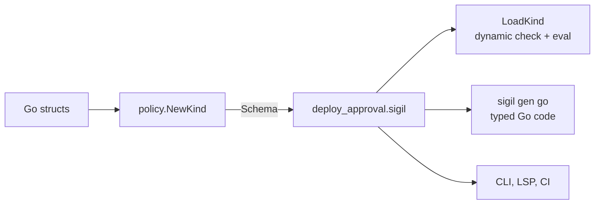

::: info Draft specification
This page specifies the language as designed. Nothing is implemented yet; see [Open questions](/project/open-questions/).
:::

A kind is the contract between a Go host and the policies it evaluates. It declares what input looks like, which host functions exist, which decisions a policy can produce and how they rank. Every policy names exactly one kind in its header and gets type-checked against it.

Kinds are defined in Go and exported to a kind file, the same way Go structs become an OpenAPI spec. Kind files use the same `.sigil` extension as policies; the `kind` header tells them apart, and by convention the file is named after the kind (`deploy_approval.sigil`). Nobody writes a kind file by hand. The defining host never loads one; everyone else can.



The exported kind file is the wire contract. Other Go services can load it dynamically or generate typed code from it, and tooling uses it without importing the host.

## A complete kind

```sigil
kind DeployApproval version 1

type Release {
  soak: duration
  hotfix: bool
}
type Service {
  name: string
  tier: string
  owners: list<string>
  labels: map<string, string>
}
type Actor {
  name: string
  teams: list<string>
  roles: list<string>
  regions: list<string>
}

input release: Release
input service: Service
input actor: Actor
input environment: string

fn split(s: string, sep: string) -> list<string>

decision deny(reason: string)
decision review(reason: string, approvers: list<string>)
decision approve(reason: string, bake: duration = 1h)

precedence deny > review > approve
default deny("no_rule_matched")
```

## Declarations

| Declaration  | Example                                                    | Purpose                                  |
| ------------ | ---------------------------------------------------------- | ---------------------------------------- |
| `kind`       | `kind DeployApproval version 1`                            | Name and contract version                |
| `type`       | `type Release { soak: duration }`                          | Struct types reachable from inputs       |
| `input`      | `input release: Release`                                   | Top-level names policies can read        |
| `fn`         | `fn split(s: string, sep: string) -> list<string>`         | Host function signatures                 |
| `decision`   | `decision review(reason: string, approvers: list<string>)` | Decision constructors and payload schema |
| `precedence` | `precedence deny > review > approve`                       | Conflict resolution order                |
| `default`    | `default deny("no_rule_matched")`                          | Result when nothing fires                |

### `kind`

```sigil
kind DeployApproval version 1
```

The header must be the first statement, and a file holds exactly one kind. The name is an identifier; policies refer to the kind by it (`policy deploy.production: DeployApproval`). The version is a positive integer that changes when the contract does; see [Versioning](#versioning).

### `type`

```sigil
type Service {
  name: string
  tier: string
  owners: list<string>
  labels: map<string, string>
}
```

Declares a struct type with named, typed fields. Fields are written `name: type` with no separator between them; the parser finds the next field by its `name:` prefix. Field names must be unique within a type. A field's type may be any [type](/reference/types/), including another struct type and an optional `?T`.

Struct types must not be recursive, directly or through other types. (proposed; Go allows `type Node struct { Next *Node }`, and a recursive type would let input describe unbounded depth, but the current design doesn't cover it.)

### `input`

```sigil
input service: Service
```

Declares a top-level name policies can read, and its type. Inputs are read-only. On the Go side each input is a field of the host's input struct with a `policy:"..."` tag.

### `fn`

```sigil
fn split(s: string, sep: string) -> list<string>
```

Declares a host function's signature. Parameter names are documentation; policies pass arguments positionally. The return type is required and can't be optional. (proposed)

Host functions must be pure and deterministic. The Go implementation may return `(T, error)`; a non-nil error becomes a [runtime error](/reference/evaluation/).

### `decision`

```sigil
decision review(reason: string, approvers: list<string>)
decision approve(reason: string, bake: duration = 1h)
```

Declares a decision constructor and its payload schema.

- The first parameter must be `reason: string`. A decision without it is rejected.
- Every other parameter is a payload field with a type and an optional default. A field without a default is required at every call site.
- Defaults must be constants.
- Field names must be unique within a decision.

How policies call these is on [Decisions](/reference/decisions/).

### `precedence`

```sigil
precedence deny > review > approve
```

Ranks decisions from highest to lowest. When candidates of different decisions compete, the highest-ranked one wins. The declaration must name every declared decision exactly once, which makes precedence a total order. (proposed; the Go side derives precedence from the order of `policy.Decisions(...)`, which is always total.)

### `default`

```sigil
default deny("no_rule_matched")
```

The result when no rule fires. It's a decision constructor with a literal reason, and every payload value must be a constant.

## Validity rules

A kind is valid when:

- the header comes first and appears once,
- every type referenced anywhere is a built-in type or a declared struct type,
- no struct type is recursive,
- inputs and host functions share one namespace and every name in it is unique,
- every decision declares `reason: string` first,
- `precedence` lists every decision exactly once,
- `default` constructs a declared decision with a literal reason and constant payload values that satisfy its schema.

`NewKind` enforces these rules on the Go side and panics at init if they fail, so a kind that exists can always be exported.

## Go type mapping

| Go                         | Sigil            |
| -------------------------- | ---------------- |
| `string`, `bool`           | `string`, `bool` |
| `int`, `int64`             | `int`            |
| `float64`                  | `float`          |
| `time.Duration`            | `duration`       |
| `time.Time`                | `timestamp`      |
| `[]T`                      | `list<T>`        |
| `map[string]T`             | `map<string, T>` |
| `*T`                       | `?T`             |
| struct with `policy:` tags | `type`           |

`NewKind` rejects anything else: channels, funcs, interfaces, non-string map keys, unexported fields. That strictness is what makes the round trip safe. `Import(Export(k))` must equal `k`, and that's a property test in the suite.

Payload structs map to decision fields the same way. A default comes from the struct tag:

```go
type ApproveData struct {
	Bake time.Duration `policy:"bake,default=1h"`
}
```

The reason is implicit on every decision and never appears in a payload struct.

::: warning Open question
`*Struct` maps to `?Struct`, which a policy can't currently unwrap because struct types have no literal. Whether `NewKind` should reject pointer-to-struct fields or the language should grow optional chaining is an [open question](/project/open-questions/).
:::

## Host functions across the boundary

A client that loads a kind can always type-check policies against it, because the `fn` signatures are in the file. Evaluating needs more: the client must bind a Go implementation for every declared function.

- `LoadKind` returns the kind and the list of functions still unbound.
- `Compile` works without bindings.
- `Eval` refuses to run until every function is bound.

A CI linter only needs the first half. A second service that evaluates policies needs both. See the [Go API](/reference/go-api/).

## Versioning

The exported kind carries a version, and `sigil breaking old/deploy_approval.sigil deploy_approval.sigil` flags incompatible changes in CI, modeled on `buf breaking`.

| Change                                         | Effect                                                         |
| ---------------------------------------------- | -------------------------------------------------------------- |
| Add an input, type field, function or decision | Compatible                                                     |
| Add a payload field with a default             | Compatible                                                     |
| Remove or rename anything                      | Breaking                                                       |
| Change a type                                  | Breaking                                                       |
| Add a payload field without a default          | Breaking                                                       |
| Reorder `precedence` or change `default`       | Breaking in behaviour, even though every policy still compiles |

::: warning Adding an input or function can collide
Inputs, host functions, params, lets and aliases share one flat namespace per policy, with no shadowing (see [Policy files](/reference/policy-files/)). A new `input approvers` therefore breaks every policy that already declares `param approvers`. `sigil breaking` only sees the two kind files, so it can't catch this; `sigil check` against the new kind can. Adding a decision is safe here because decision names live in their own namespace.
:::

A policy's header names a kind but not a version. Whether policies should pin a kind version, and what happens when they don't match, is unspecified. For the operational side of changing a kind, see [Evolve a kind safely](/guides/evolve-a-kind/).
