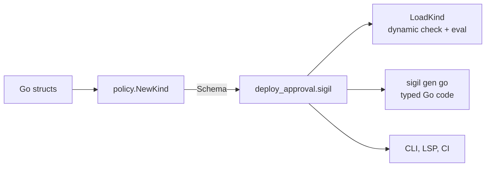

::: info Draft specification
This page specifies the language as designed. Syntax, kinds, type checking, rules, decisions, asserts and the evaluation trace are implemented; composition (imports and invocation) and the CLI aren't yet. See [Open questions](/project/open-questions/).
:::

A kind is the contract between a Go host and the policies it evaluates. It declares what input looks like, which host functions exist, which decisions a policy can produce, and whether one of them wins or all of them apply. Every policy names exactly one kind in its header and gets type-checked against it.

Kinds are defined in Go and exported to a kind file, the same way Go structs become an OpenAPI spec. Kind files use the same `.sigil` extension as policies and modules; the `kind` header tells them apart, and by convention the file is named after the kind (`deploy_approval.sigil`). Nobody writes a kind file by hand. The defining host never loads one; everyone else can.


```mermaid
flowchart LR
  A[Go structs] --> B[policy.NewKind]
  B -- Schema --> C[deploy_approval.sigil]
  C --> D[LoadKind<br/>dynamic check + eval]
  C --> E[sigil gen go<br/>typed Go code]
  C --> F[CLI, LSP, CI]
```

The exported kind file is the wire contract. Other Go services can load it dynamically or generate typed code from it, and tooling uses it without importing the host.

## A complete kind

```sigil
kind DeployApproval version 1

type Release {
  soak: duration
  hotfix: bool
}
type Service {
  name: string
  tier: string
  owners: list<string>
  labels: map<string, string>
}
type Actor {
  name: string
  teams: list<string>
  roles: list<string>
  regions: list<string>
}

input release: Release
input service: Service
input actor: Actor
input environment: string

fn split(string, string) -> list<string>

decision deny {
  not_eligible
  soak_too_short
  no_rule_matched
}
decision review(approvers: list<string>) {
  service_owner
}
decision approve(bake: duration = 1h) {
  release_manager
  payments_sre
}

collect one
precedence deny > review > approve
precedence approve: release_manager > payments_sre
default deny(no_rule_matched)
```

## Declarations

| Declaration  | Example                                                    | Purpose                                  |
| ------------ | ---------------------------------------------------------- | ---------------------------------------- |
| `kind`       | `kind DeployApproval version 3, accepts: 2`                | Name, contract version, and the oldest version policies may still pin |
| `type`       | `type Release { soak: duration }`                          | Struct types reachable from inputs       |
| `input`      | `input release: Release`                                   | Top-level names policies can read        |
| `fn`         | `fn split(string, string) -> list<string>`         | Host function signatures                 |
| `decision`   | `decision review(approvers: list<string>) { service_owner }` | Decision constructors: payload schema and reasons |
| `collect`    | `collect one` or `collect all`                             | One winner, or every decision that fired |
| `precedence` | `precedence deny > review > approve`                       | Ranks decisions for `collect one`        |
| `exclusive`  | `exclusive grant_a, grant_b`             | Outcomes that can't fire together              |
| `default`    | `default deny(no_rule_matched)`                          | Result when nothing fires; optional with `collect all` |

### `kind`

```sigil
kind DeployApproval version 1
kind DeployApproval version 3, accepts: 2
```

The header must be the first statement, and a file holds exactly one kind. The name is an identifier; policies refer to it together with the version they were written against (`policy deploy.production: DeployApproval@1`). The version is a positive integer that changes whenever the contract does. `accepts` names the oldest version a policy may still pin; it's optional and defaults to 1, which accepts every version. See [Versioning](#versioning).

### `type`

```sigil
type Service {
  name: string
  tier: string
  owners: list<string>
  labels: map<string, string>
}
```

Declares a struct type with named, typed fields. Fields are written `name: type` with no separator between them; the parser finds the next field by its `name:` prefix. Field names must be unique within a type. A field's type may be any [type](/reference/types/), including another struct type and an optional `?T`.

`type Version ordered` declares a [host-ordered type](/reference/types/#host-ordered-types) instead: opaque, with no fields, ordered by the Go type's `Compare(T) int` method. `NewKind` requires the method, so the kind file never declares it as an `fn`. (proposed)

Struct types must not be recursive, directly or through other types. Go allows `type Node struct { Next *Node }`, but policies can't loop, so a recursive type could only ever be read to a fixed depth; `NewKind` and the kind loader reject one, naming the cycle.

### `input`

```sigil
input service: Service
```

Declares a top-level name policies can read, and its type. Inputs are read-only. On the Go side each input is a field of the host's input struct with a `policy:"..."` tag.

### `fn`

```sigil
fn split(string, string) -> list<string>
```

Declares a host function's signature: the parameter types and the result type. Parameters have no names, because policies pass arguments positionally and a Go function's parameter names aren't recoverable by reflection anyway. The return type is required and can't be optional.

Host functions must be pure and deterministic. The Go implementation may return `(T, error)`; a non-nil error becomes a [runtime error](/reference/evaluation/).

### `decision`

```sigil
decision review(approvers: list<string>) {
  service_owner
}
decision approve(bake: duration = 1h) {
  release_manager
  payments_sre
}
```

Declares a decision constructor: its payload schema in parentheses, and the reasons it can be constructed with in the block.

- The block lists the decision's reasons, one identifier per line, at least one. A constructor names one of them, `approve(payments_sre, bake: 15m)`, and any other name is a compile error with a did-you-mean hint.
- Reasons are scoped to their decision. `deny` and `approve` may both declare `release_manager`; they're two names, `deny.release_manager` and `approve.release_manager`.
- The block is a set. Its order means nothing; ranking reasons is a separate declaration, the [scoped `precedence`](#precedence).
- Every parameter is a payload field with a type and an optional default. A field without a default is required at every call site. Defaults must be constants, and field names must be unique within a decision.
- A decision with no payload leaves the parentheses out.

Declaring reasons in the kind is what makes a reason a compile-time name instead of a string: a typo in a reason can't create a new metric series, `sigil breaking` sees a removed reason, and asserts and `exclusive` can name a reason. The cost is that a new reason is a kind change, like a new decision. See [Reasons declared in the kind](/project/open-questions/#reasons-declared-in-the-kind).

How policies call these is on [Decisions](/reference/decisions/).

### `collect`

```sigil
collect one
precedence deny > review > approve
```

```sigil
collect all
```

Declares how many candidates the host gets back. Every kind declares it, so a reader knows the shape of the result from one line, and leaving out a line can't silently switch a kind from one winner to many.

|               | without `precedence`                        | with `precedence`                                              |
| ------------- | ------------------------------------------- | -------------------------------------------------------------- |
| `collect one` | Error: nothing picks the winner             | One winner: the top-ranked candidate, or a conflict error when several share the top rank |
| `collect all` | Every candidate that fired                  | Every candidate at the top rank                                |

`collect one` without `precedence` is an error because the only thing left to pick a winner by would be source position, and choosing between different decisions by position would make rule order matter. `collect` and `precedence` are independent: `precedence` ranks, and `collect` says how many candidates of the top rank come back. How the top rank is formed, and what happens when it holds more than one candidate, is on [Evaluation semantics](/reference/evaluation/#resolution).

### `precedence`

```sigil
precedence deny > review > approve
precedence approve: release_manager > payments_sre
```

The first form ranks decisions from highest to lowest. It must name every declared decision exactly once, which makes it a total order, and it's required with `collect one`. The Go side derives it from the order of `policy.WithDecisions(...)`, which is always total.

The second form ranks the reasons of one decision, and is optional. It comes into play only when candidates of the same decision compete, and it must name every reason of that decision exactly once. A decision without one has unranked reasons, which is fine wherever ties between them can't matter, and a [conflict](/reference/evaluation/#resolution) under `collect one` where they can.

Reasons of different decisions never rank against each other. `deny > approve.release_manager > review` isn't a valid declaration: the decision line says which decision the host gets, and the reason line says which candidate of it, so the story "flip `deny` above `review` when the rules are trusted" stays one line about decisions.

### `exclusive`

```sigil
exclusive grant_a, grant_b
exclusive approve.release_manager, approve.lgtm
```

Declares that at most one of the listed outcomes may fire in one evaluation. Candidates from two of them together are a conflict, the evaluation fails with a `*ConflictError`, and the host gets the default. It's the same relation `exclusive in` tests over `outcome`, declared by the host in the kind, where no `when` can gate it and no policy has to be required to carry it.

- Each entry is a decision, matching any of its reasons, or a decision with one reason.
- A set names at least two entries. A kind may declare any number of sets, and one outcome may appear in several.
- The check happens before ranking, so an exclusive pair is a conflict even when a third decision outranks both. A contradiction between two rules doesn't stop being one because a deny happened to fire too.
- It works the same under `collect one` and `collect all`. In a `collect all` kind it replaces the pattern of an `exclusive in outcome` assert in a required policy; that assert still works, but it belongs to a policy author, and this line belongs to the host.

In `collect one`, the relative rank of an exclusive pair is unobservable, since they never both survive to be ranked. `precedence` still has to list them; a lint can point out that the order between them never matters.

### Collecting kinds

A `collect all` kind is a collecting kind: instead of one winner, the host gets every candidate that fired.

Collecting fits decisions that combine instead of competing, such as roles a user can hold at the same time:

```sigil
kind AccessGrant version 1

type Actor {
  name: string
  groups: list<string>
  clearance: string
}

input actor: Actor

decision read {
  engineering_member
}
decision write {
  platform_member
}
decision admin(ttl: duration = 8h) {
  oncall
}
decision customer_data_writer {
  data_engineer
}
decision development_environment_writer {
  platform_member
}

collect all
```

A policy for this kind grants each role in its own `when` block, and several can fire for one actor. Nothing ranks them and no candidate can cancel another, so a collecting kind has no `deny` in the usual sense. Its guardrails are [asserts](/reference/policy-files/#assert) instead, typically in a policy the host [requires](/reference/evaluation/#required-policies):

```sigil
policy access.guardrails: AccessGrant@1

assert("sod_customer_dev",
  [customer_data_writer, development_environment_writer] exclusive in outcome)
```

How the candidates are ordered and returned is on [Evaluation semantics](/reference/evaluation/#collecting-kinds).

### `default`

```sigil
default deny(no_rule_matched)
```

The result when no rule fires. It's a decision constructor with one of the decision's declared reasons, and every payload value must be a constant.

A `collect one` kind must declare a default. A collecting kind may leave it out, and then an evaluation where nothing fires returns no decisions at all.

## Validity rules

A kind is valid when:

- the header comes first and appears once,
- `accepts`, if declared, is between 1 and the version,
- every type referenced anywhere is a built-in type or a declared struct type,
- no struct type is recursive,
- inputs and host functions share one namespace and every name in it is unique,
- every decision declares at least one reason, and a reason is unique within its decision,
- `collect` is declared once, as `collect one` or `collect all`,
- `precedence` over decisions is declared with `collect one` and lists every decision exactly once; a scoped `precedence` names a declared decision, appears at most once per decision and lists every reason of that decision exactly once,
- every `exclusive` set names at least two declared decisions or reasons,
- `default` is declared if the kind is `collect one`, and constructs a declared decision with one of its reasons and constant payload values that satisfy its schema.

`NewKind` enforces these rules on the Go side and panics at init if they fail, so a kind that exists can always be exported.

## Go type mapping

| Go                         | Sigil            |
| -------------------------- | ---------------- |
| `string`, `bool`           | `string`, `bool` |
| `int`, `int64`             | `int`            |
| `float64`                  | `float`          |
| `time.Duration`            | `duration`       |
| `time.Time`                | `timestamp`      |
| `[]T`                      | `list<T>`        |
| `map[K]T`, scalar `K`      | `map<K, T>`      |
| `*T`                       | `?T`             |
| `*[]T`, `*map[K]T`         | rejected         |
| struct with `policy:` tags | `type`           |
| type registered with `policy.WithOrdered[T](name)` | `type name ordered` (proposed) |

`NewKind` rejects anything else: channels, funcs, interfaces, pointers to slices, maps or pointers, map keys that aren't scalars, unexported fields. That strictness is what makes the round trip safe. `Import(Export(k))` must equal `k`, and that's a property test in the suite.

Payload structs map to decision fields the same way. A default comes from the struct tag:

```go
type ApproveData struct {
	Bake time.Duration `policy:"bake,default=1h"`
}
```

The reason is implicit on every decision and never appears in a payload struct.

`*Struct` maps to `?Struct`, whose fields a policy reads with [optional chaining](/reference/expressions/#optional-chaining): `release?.soak ?? 0s`. A pointer to a slice or a map is rejected, and so are `?list<T>` and `?map<K, V>` in a kind file: a nil slice or map already reads as empty, so an optional one would add a second way to say "nothing" that policies couldn't tell apart.

## Host functions across the boundary

A client that loads a kind can always type-check policies against it, because the `fn` signatures are in the file. Evaluating needs more: the client must bind a Go implementation for every declared function.

- `LoadKind` returns the kind and the list of functions still unbound.
- `Compile` works without bindings.
- `Eval` refuses to run until every function is bound.

A CI linter only needs the first half. A second service that evaluates policies needs both. See the [Go API](/reference/go-api/).

## Versioning

A kind carries two numbers, and every policy and module pins the version it was written against:

```sigil
kind DeployApproval version 3, accepts: 2
```

```sigil
policy deploy.production: DeployApproval@2
```

The host only ever has its current kind. Every document compiles against it, whatever its pin says; the pin is the author's statement that the document was checked against that version, and the loader uses it three ways:

- A pin from `accepts` up to `version` loads normally.
- A pin below `accepts` is a compile error. Raising `accepts` is how a host says a change needs every team to look again.
- A pin above `version` is a compile error, because the document was written for a kind this host doesn't have yet.

The host never keeps old kinds around. Its whole cost is two numbers, set with `policy.WithVersion` and `policy.WithAccepts` in Go, and the rule for changing them:

- Every change to the contract bumps `version`, including compatible ones. The [namespace rule](#adding-a-name-never-breaks-a-policy) relies on that.
- A breaking change also raises `accepts` to the new version.

`sigil breaking old/deploy_approval.sigil deploy_approval.sigil` enforces both in CI, modeled on `buf breaking`: it fails when the contract changed and `version` didn't, and when a change is breaking and `accepts` wasn't raised. It needs nothing but the two kind files.

| Change                                         | Effect                                                         |
| ---------------------------------------------- | -------------------------------------------------------------- |
| Add an input, type field, function, decision or reason | Compatible                                             |
| Add a payload field with a default             | Compatible                                                     |
| Remove or rename anything                      | Breaking                                                       |
| Change a type                                  | Breaking                                                       |
| Add a payload field without a default          | Breaking                                                       |
| Reorder `precedence`, add or reorder a scoped `precedence`, add an `exclusive` set, or change `default` | Breaking in behaviour, even though every policy still compiles |
| Switch between `collect one` and `collect all` | Breaking                                                       |

A breaking change that the type checker catches, such as a removed field, would fail the affected policies anyway; raising `accepts` turns a scattered set of type errors into one clear message per document. For a change that still compiles, such as a reordered `precedence`, raising `accepts` is the only thing that stops old policies from silently meaning something new.

### Adding a name never breaks a policy

Inputs, host functions and decisions share one flat namespace with a policy's params, lets, imports and quantifier variables, and nothing shadows anything (see [Identifiers](/reference/policy-files/#identifiers)). Without pins, a new `input approvers` would break every policy that already declares `param approvers`.

Pins make the collision safe to resolve. A document pinned to `@N` compiled against version N, where any collision was an error. So when a document pinned below the current version collides with an input, host function or decision, the kind must have added that name after the document was written. The document keeps its own name, the kind's new name is out of reach in that document, and the [`shadowed-kind-name`](/reference/cli/#lints) lint reports it so the team renames and raises the pin at its own pace. A document pinned to the current version gets the usual collision error, because its author wrote it knowing the name.

For the operational side of changing a kind, see [Evolve a kind safely](/guides/evolve-a-kind/).
