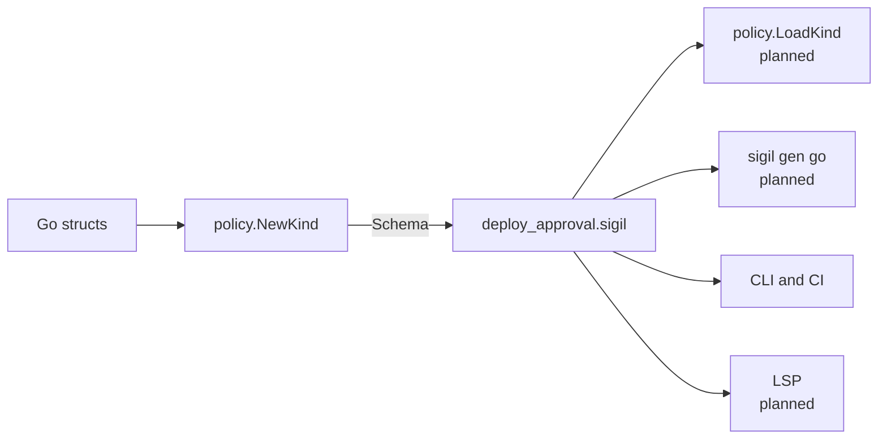

A kind is the contract between a Go host and the policies it evaluates. It declares what input looks like, which host functions exist, which decisions a policy can produce, and whether one of them wins or all of them apply. Every policy names exactly one kind in its header and gets type-checked against it.

This page is the reference for the kind file format and its validity rules, and for how a host's Go types map onto it. Policy authors read kind files to learn what they can write; host engineers define the kind in Go and export it.

Kinds are defined in Go with `policy.NewKind` and exported to a kind file with `Schema()`, the same way Go structs become an OpenAPI spec. Kind files use the same `.sigil` extension as policies and modules; the `kind` header tells them apart, and by convention the file is named after the kind (`deploy_approval.sigil`). The defining host always uses its Go definition. Tooling reads the exported file: `sigil check --kind`, `eval`, `explain` and `test`, and CI jobs in a policy repository that doesn't import the host.


```mermaid
flowchart LR
  A[Go structs] --> B[policy.NewKind]
  B -- Schema --> C[deploy_approval.sigil]
  C --> D[policy.LoadKind<br/>planned]
  C --> E[sigil gen go<br/>planned]
  C --> F[CLI and CI]
  C --> G[LSP<br/>planned]
```

::: warning Planned
A public `policy.LoadKind` for Go services that load a kind file instead of defining the kind, `sigil gen go` and the language server don't exist yet. The `sigil gen go` and `sigil lsp` commands are placeholders.
:::

## A complete kind

```sigil
kind DeployApproval version 1

type Release {
  soak: duration
  hotfix: bool
}

type Service {
  name: string
  tier: string
  owners: list<string>
  labels: map<string, string>
}

type Actor {
  name: string
  teams: list<string>
  roles: list<string>
  regions: list<string>
}

input release: Release
input service: Service
input actor: Actor
input environment: string

fn split(string, string) -> list<string>

decision deny {
  not_eligible
  soak_too_short
  no_rule_matched
}

decision review(approvers: list<string>) {
  service_owner
}

decision approve(bake: duration = 1h) {
  release_manager
  payments_sre
}

collect one
precedence deny > review > approve
precedence deny: not_eligible > soak_too_short > no_rule_matched
precedence approve: release_manager > payments_sre

default deny(no_rule_matched)
```

## Declarations

| Declaration  | Example                                                      | Purpose                                                                |
| ------------ | ------------------------------------------------------------ | ---------------------------------------------------------------------- |
| `kind`       | `kind DeployApproval version 3, accepts: 2`                  | Name, contract version, and the oldest version policies may still pin |
| `type`       | `type Release { soak: duration }`                            | Struct types used by inputs, host functions and payloads               |
| `input`      | `input release: Release`                                     | Top-level names policies can read                                      |
| `fn`         | `fn split(string, string) -> list<string>`                   | Host function signatures                                               |
| `decision`   | `decision review(approvers: list<string>) { service_owner }` | Decision constructors: payload schema and reasons                      |
| `collect`    | `collect one` or `collect all`                               | One winner, or every decision that fired                               |
| `precedence` | `precedence deny > review > approve`                         | Ranks decisions, or the reasons of one decision                        |
| `exclusive`  | `exclusive grant_a, grant_b`                                 | Outcomes that can't fire together                                      |
| `default`    | `default deny(no_rule_matched)`                              | Result when nothing fires; optional with `collect all`                 |

### `kind`

```sigil
kind DeployApproval version 3, accepts: 2
```

The header must be the first statement, and a file holds exactly one kind. The name is an identifier; policies refer to it together with the version they were written against (`policy deploy.production: DeployApproval@1`). The version is a positive integer that changes whenever the contract does. `accepts` names the oldest version a policy may still pin, from 1 up to the version; it's optional and defaults to 1, which accepts every version, so `kind DeployApproval version 1` is a complete header. In Go, the name is `NewKind`'s first argument and the numbers come from `policy.WithVersion` and `policy.WithAccepts`; a kind without `WithVersion` doesn't build. See [Versioning](#versioning).

### `type`

```sigil
type Service {
  name: string
  tier: string
  owners: list<string>
  labels: map<string, string>
}
```

Declares a struct type with named, typed fields. Fields are written `name: type` with no separator between them; the parser finds the next field by its `name:` prefix. Field names must be unique within a type and may be spelled like keywords. A field's type may be any [type](/reference/types/) except `decision`, including another struct type and an optional `?T`. A type's name can't be a built-in type name such as `string` or `list`, and types may refer to each other in any order.

::: warning Planned
`type Version ordered` would declare a [host-ordered type](/reference/types/#host-ordered-types): opaque, with no fields, ordered by the Go type's `Compare(T) int` method. Neither the kind file syntax nor `policy.WithOrdered` exists yet.
:::

Struct types must not be recursive, directly or through other types. Go allows `type Node struct { Next *Node }`, but policies can't loop, so a recursive type could only ever be read to a fixed depth; `NewKind` and the kind loader reject one, naming the cycle.

### `input`

```sigil
input service: Service
```

Declares a top-level name policies can read, and its type. Inputs are read-only. On the Go side each input is a field of the host's input struct with a `policy:"..."` tag.

### `fn`

```sigil
fn split(string, string) -> list<string>
```

Declares a host function's signature: the parameter types and the result type. Parameters have no names, because policies pass arguments positionally and a Go function's parameter names aren't recoverable by reflection anyway. The return type is required and can't be optional.

Host functions must be pure and deterministic. The Go implementation returns `T` or `(T, error)`; a non-nil error becomes a [runtime error](/reference/evaluation/#runtime-errors). Variadic Go functions are rejected, because policies pass a fixed number of arguments.

### `decision`

```sigil
decision review(approvers: list<string>) {
  service_owner
}

decision approve(bake: duration = 1h) {
  release_manager
  payments_sre
}
```

Declares a decision constructor: its payload schema in parentheses, and the reasons it can be constructed with in the block.

- The block lists the decision's reasons, at least one, separated by whitespace; `sigil fmt` writes one per line. A constructor names one of them, `approve(payments_sre, bake: 15m)`, and any other name is a compile error with a did-you-mean hint.
- Reasons are scoped to their decision. `deny` and `approve` may both declare `release_manager`; they're two names, `deny.release_manager` and `approve.release_manager`.
- The block is a set. Its order means nothing; ranking reasons is a separate declaration, the [scoped `precedence`](#precedence).
- Every parameter is a payload field with a type and an optional default. A field without a default is required at every call site. Defaults must be constants of the field's type, and field names must be unique within a decision. A field can't be called `reason`, since every constructor already names its reason first.
- A decision with no payload leaves the parentheses out; `sigil fmt` drops empty ones.

Declaring reasons in the kind makes a reason a compile-time name: a typo can't create a new metric series, and asserts and `exclusive` can name a reason. Removing a reason is a breaking change that the planned `sigil breaking` command will detect. Adding a reason changes the kind, like adding a decision. See [Reasons declared in the kind](/project/open-questions/#reasons-declared-in-the-kind).

How policies call these is on [Decisions](/reference/decisions/).

### `collect`

```sigil
collect one
precedence deny > review > approve
```

```sigil
collect all
```

Declares how many candidates the host gets back. Every kind declares it, so a reader knows the shape of the result from one line, and leaving out a line can't silently switch a kind from one winner to many. In Go, `policy.WithDecisions` makes a `collect one` kind and `policy.WithCollect` a `collect all` kind; a kind uses one of them, not both.

|               | without `precedence`                        | with `precedence`                                              |
| ------------- | ------------------------------------------- | -------------------------------------------------------------- |
| `collect one` | Error: nothing picks the winner             | One winner: the top-ranked candidate, or a conflict error when several share the top rank |
| `collect all` | Every candidate that fired                  | Every candidate at the top rank                                |

`collect one` without `precedence` is an error because the only thing left to pick a winner by would be source position, and choosing between different decisions by position would make rule order matter. `collect` and `precedence` are independent: `precedence` ranks, and `collect` says how many candidates of the top rank come back. How the top rank is formed, and what happens when it holds more than one candidate, is on [Evaluation semantics](/reference/evaluation/#resolution).

### `precedence`

```sigil
precedence deny > review > approve
precedence approve: release_manager > payments_sre
```

The first form ranks decisions from highest to lowest. It must name every declared decision exactly once, which makes it a total order. It's required with `collect one` and optional with `collect all`, and a kind declares it at most once. The Go side derives it from the order of `policy.WithDecisions(...)`, which is always total; a `WithCollect` kind ranks its decisions with `policy.WithPrecedence(...)`.

The second form ranks the reasons of one decision, and is optional. It comes into play only when candidates of the same decision compete. A decision takes at most one, and it must name every reason of that decision exactly once. In Go it's `policy.WithReasonPrecedence(reasons...)`, with a reason handle from `Decision[T].Reason` for each reason, all of one decision. A decision without one has unranked reasons, which is fine wherever ties between them can't matter, and a [conflict](/reference/evaluation/#resolution) under `collect one` where they can. In a `collect all` kind with `precedence`, a decision with ranked reasons at the top rank returns only the candidates with the highest-ranked reason that fired.

Reasons of different decisions never rank against each other. `deny > approve.release_manager > review` isn't a valid declaration: the decision line says which decision the host gets, and the reason line says which candidate of it, so reordering decisions stays a one-line change that never touches reasons.

### `exclusive`

```sigil
exclusive grant_a, grant_b
exclusive approve.release_manager, approve.payments_sre
```

Declares that at most one of the listed outcomes may fire in one evaluation. Candidates from two of them together are a conflict, and evaluation fails with a `*ConflictError`. The host gets the default for `collect one` and an empty outcome for `collect all`. It's the same relation `exclusive in` tests over `outcome`, declared by the host in the kind, where no `when` can gate it and no policy has to be required to carry it.

- Each entry is a decision, matching any of its reasons, or a decision with one reason. In Go, `policy.WithExclusive(GrantA, GrantB)` or `policy.WithExclusive(Approve.Reason("release_manager"), Approve.Reason("payments_sre"))`.
- A set names at least two entries. A kind may declare any number of sets, and one outcome may appear in several.
- The check happens before ranking, so an exclusive pair is a conflict even when a third decision outranks both. A contradiction between two rules doesn't stop being one because a deny happened to fire too.
- It works the same under `collect one` and `collect all`. In a `collect all` kind it replaces the pattern of an `exclusive in outcome` assert in a required policy; that assert still works, but it belongs to a policy author, and this line belongs to the host.

In `collect one`, the relative rank of an exclusive pair is unobservable, since they never both survive to be ranked. `precedence` still has to list them.

### Collecting kinds

A `collect all` kind without `precedence` returns every candidate after folding duplicates. With `precedence`, it returns every folded candidate at the top rank. Exclusive conflicts still fail evaluation before ranking.

Collecting fits decisions that combine instead of competing, such as roles a user can hold at the same time:

```sigil
kind AccessGrant version 1

type Actor {
  name: string
  groups: list<string>
  clearance: string
}

input actor: Actor

decision read {
  engineering_member
}

decision write {
  platform_member
}

decision admin(ttl: duration = 8h) {
  oncall
}

decision customer_data_writer {
  data_engineer
}

decision development_environment_writer {
  platform_member
}

collect all
```

A policy for this kind grants each role in its own `when` block, and several can fire for one actor. Nothing ranks them and no candidate can cancel another, so a collecting kind has no `deny` in the usual sense. Its guardrails are [asserts](/reference/policy-files/#assert) instead, typically in a policy the host [requires](/reference/evaluation/#required-policies):

```sigil
policy access.guardrails: AccessGrant@1

assert("sod_customer_dev",
  [customer_data_writer, development_environment_writer] exclusive in outcome)
```

How the candidates are ordered and returned is on [Evaluation semantics](/reference/evaluation/#collecting-kinds).

### `default`

```sigil
default deny(no_rule_matched)
```

The result when no rule fires. It's a decision constructor with one of the decision's declared reasons, and every payload value must be a constant. Fields with a default may be left out, as in any constructor.

A `collect one` kind must declare a default. A collecting kind may leave it out, and then an evaluation where nothing fires returns no decisions at all.

In Go, `policy.WithDefault(Deny.Reason("no_rule_matched"))` takes no payload: every field takes its default, so every payload field of the default decision needs a `default=` tag.

## Validity rules

A kind is valid when:

- the header comes first, the file holds no other document, and the name is an identifier,
- the version is a positive integer and `accepts`, if declared, is at least 1 and at most the version,
- type names are unique and aren't built-in type names, and field names are unique within a type,
- every type referenced anywhere is a built-in type or a declared struct type, no field, input or function uses the `decision` type, map keys are scalars (`bool`, `int`, `float`, `string`, `duration` or `timestamp`), optionals don't nest, and no list or map is optional,
- no struct type is recursive,
- inputs and host functions share one namespace and every name in it is unique,
- no host function returns an optional,
- the kind declares at least one decision, decision names are unique, and none has a payload field called `reason`,
- every decision declares at least one reason, a reason is unique within its decision, and every payload default is a constant of the field's type,
- `collect` is declared once, as `collect one` or `collect all`,
- `precedence` over decisions is declared at most once, is required with `collect one`, and lists every decision exactly once; a scoped `precedence` names a declared decision, appears at most once per decision and lists every reason of that decision exactly once,
- every `exclusive` set names at least two outcomes, each a declared decision or one of its declared reasons,
- `default` is declared at most once, is required with `collect one`, and constructs a declared decision with one of its reasons, passing a constant of the right type for every field without a default.

The kind loader behind `sigil check --kind` reports every violation with its position. `NewKind` checks the same rules on the Go side and panics listing every problem, so a bad kind fails at program start and a kind that exists can always be exported.

## Canonical form

`Schema()` always writes the declarations in this order:

1. the header, with `, accepts: N` only when `N` is above 1,
2. the struct types, in the order the input struct, then the host functions, then the payload structs first reach them,
3. the inputs, in field order, then the host functions, in `WithFunc` order,
4. the decisions, in `WithDecisions` or `WithCollect` order,
5. `collect`, the decision `precedence`, each scoped `precedence` and each `exclusive` set,
6. the `default`.

Blank lines separate the header, each type, the inputs, the functions, each decision, the resolution lines and the default, as `sigil fmt` lays them out. `sigil fmt` doesn't reorder declarations in a hand-written kind file; the order above is only what an export produces.

Loading an exported file gives back the kind it came from, and fuzz tests check that round trip. `sigil export --check` in CI fails when the checked-in file no longer matches the host's `Schema()`. A bundle may also carry the kind file: a kind document with the host's kind name must print the same canonical text as the host's `Schema()`, or compilation fails with `kind document DeployApproval doesn't match the host's kind`, and a kind document for any other kind is ignored.

## Go type mapping

`NewKind[In]` walks the input struct `In` by reflection. Every field with a `policy:"name"` tag becomes an input, every struct type it reaches becomes a `type` named after the Go type, and every tagged field of those structs becomes a field. Untagged fields and fields tagged `policy:"-"` are invisible to policies.

| Go                                   | Sigil            |
| ------------------------------------ | ---------------- |
| `string`, `bool`                     | `string`, `bool` |
| `int`, `int64`                       | `int`            |
| `float64`                            | `float`          |
| `time.Duration`                      | `duration`       |
| `time.Time`                          | `timestamp`      |
| `[]T`                                | `list<T>`        |
| `map[K]T`, scalar `K`                | `map<K, T>`      |
| `*T`                                 | `?T`             |
| `*[]T`, `*map[K]T`, `**T`            | rejected         |
| named struct with `policy:` tags     | `type`           |

A named type follows its underlying type, so `type Tier string` maps to `string`. `NewKind` rejects anything else, and lists every problem it finds: other integer and float sizes, unsigned integers, channels, funcs, interfaces, anonymous structs, two Go types with the same name, map keys that aren't scalars, tagged fields that are unexported or embedded, and tag options on anything but a payload field.

Payload structs map to decision fields the same way. A default comes from the struct tag, parsed as a Sigil constant of the field's type:

```go
type ApproveData struct {
	Bake time.Duration `policy:"bake,default=1h"`
}
```

`default=` is the only tag option, and only payload fields take it: inputs and the fields of `type` structs have no defaults, in Go as in a kind file, so an option on one of their tags makes `NewKind` panic. A decision without a payload uses `policy.None`. The reason is implicit on every decision and never appears in a payload struct; the reasons are the ones passed to `policy.NewDecision`, and Go code names one through a handle from `Decision[T].Reason`, which panics on a reason the decision doesn't declare.

`*Struct` maps to `?Struct`, whose fields a policy reads with [optional chaining](/reference/expressions/#optional-chaining): `release?.soak ?? 0s`. A pointer to a slice or a map is rejected, and so are `?list<T>` and `?map<K, V>` in a kind file: a nil slice or map already reads as empty, so an optional one would add a second way to say "nothing" that policies couldn't tell apart.

Host function signatures come from the Go function's type: each parameter type maps like a field, and the result is `T` or `(T, error)`.

## Host functions across the boundary

The stock `sigil` CLI type-checks policies against a kind file's `fn` signatures alone. It also evaluates them, until evaluation reaches a call to a host function, which fails with a runtime error because the CLI has no implementation. A call in a branch that doesn't run doesn't get in the way. A host builds its own CLI with `pkg/cli` to link its kind and the real implementations.

::: warning Planned
A public `policy.LoadKind`, and a way to bind Go functions to a loaded kind file, don't exist yet. See the [Go API](/reference/go-api/#loading-a-kind-elsewhere).
:::

## Versioning

A kind carries two numbers, and every policy and module pins the version it was written against:

```sigil
kind DeployApproval version 3, accepts: 2
```

```sigil
policy deploy.production: DeployApproval@2
```

The host only ever has its current kind. Every document compiles against it, whatever its pin says; the pin is the author's statement that the document was checked against that version, and the loader uses it three ways:

- A pin from `accepts` up to `version` loads normally.
- A pin below `accepts` is a compile error. Raising `accepts` is how a host says a change needs every team to look again.
- A pin above `version` is a compile error, because the document was written for a kind this host doesn't have yet.

The host never keeps old kinds around. Its whole cost is two numbers, set with `policy.WithVersion` and `policy.WithAccepts` in Go, and the rule for changing them:

- Every change to the contract bumps `version`, including compatible ones. The [namespace rule](#adding-a-name-never-breaks-a-policy) relies on that.
- A breaking change also raises `accepts` to the new version.

The planned `sigil breaking old/deploy_approval.sigil deploy_approval.sigil` command will enforce both rules in CI from the two kind files. Until it exists, review `version` and `accepts` changes by hand.

| Change                                         | Effect                                                         |
| ---------------------------------------------- | -------------------------------------------------------------- |
| Add an input, type field, function, decision or reason | Compatible                                             |
| Add a payload field with a default             | Compatible                                                     |
| Remove or rename anything                      | Breaking                                                       |
| Change a type                                  | Breaking                                                       |
| Add a payload field without a default          | Breaking                                                       |
| Reorder `precedence`, add or reorder a scoped `precedence`, add an `exclusive` set, or change `default` | Breaking in behavior, even though every policy still compiles |
| Switch between `collect one` and `collect all` | Breaking                                                       |

A breaking change that the type checker catches, such as a removed field, would fail the affected policies anyway; raising `accepts` adds one error per document saying which version it was written for, next to the type errors, so the author knows to review the kind's changes and not just patch each error. For a change that still compiles, such as a reordered `precedence`, raising `accepts` is the only thing that stops old policies from silently meaning something new.

Payload fields that an assert reads through [`outcome.<decision>`](/reference/expressions/#candidates) follow the same rule as input fields: a document reads what the host's kind declares now, whatever its pin, so one pinned to an older version can already read a field added since. Payload fields aren't in the namespace below, so adding one never collides with a policy's names.

### Adding a name never breaks a policy

Inputs, host functions and decisions share one flat namespace with a policy's params, lets, imports and quantifier and filter variables, and nothing shadows anything (see [Identifiers](/reference/policy-files/#identifiers)). Without pins, a new `input approvers` would break every policy that already declares `param approvers`.

Pins make the collision safe to resolve. A document pinned to `@N` compiled against version N, where any collision was an error. So when a document pinned below the current version collides with an input, host function or decision, the kind must have added that name after the document was written. The document keeps its own name, the kind's new name is out of reach in that document, and the [`shadowed-kind-name`](/reference/cli/#lints) lint reports it so the team renames and raises the pin at its own pace. A document pinned to the current version gets the usual collision error, because its author wrote it knowing the name.

For the operational side of changing a kind, see [Evolve a kind safely](/guides/evolve-a-kind/).
