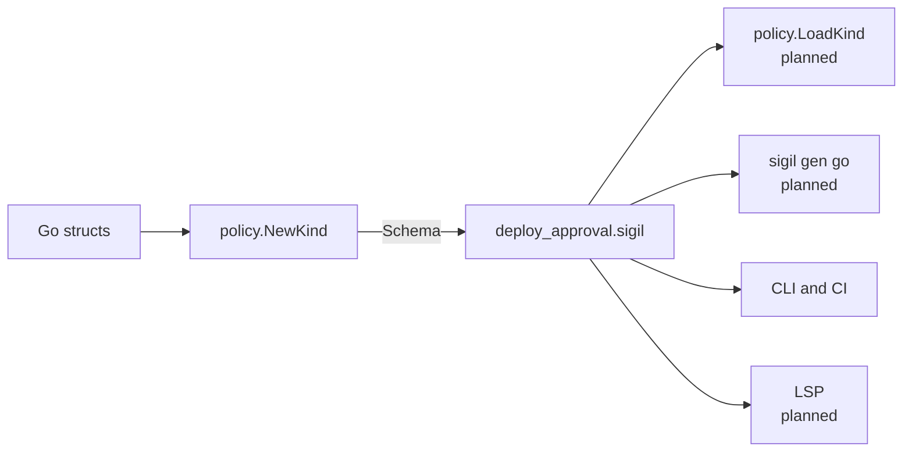

A YAML rule engine interprets its matchers at run time, so `tier: "critical"` and `teir: "critical"` are both valid, and only one of them ever matches. Sigil moves that knowledge into a _kind_: a contract, written by the host, that says what input looks like, which host functions exist, which decisions a policy can produce and how they combine. Every policy names one kind in its header and gets type-checked against it before it can run. [Strict schema, forgiving data](/understanding/strictness/) explains what that buys at compile time.

The declarations are specified in [Kind files](/reference/kind-files/), and the Go side in the [Go API](/reference/go-api/#kinds).

## Why the contract comes from Go

The host is the party that has to act on a decision. It decodes requests into Go structs, it knows which decisions it can carry out, and it implements the host functions. So the kind starts as the host's Go types: `policy.NewKind` reflects over the input struct and the payload structs, and `Schema()` renders the result as a kind file, the same way Go structs become an OpenAPI spec.



The defining host always uses its Go definition. Everything else reads the exported file: `sigil check`, `eval`, `explain` and `test`, and CI jobs in a policy repository that doesn't import the host's code. A policy author never needs the host's source to learn what they can write, and the host never needs to trust a copy of its own contract.

Going through Go has a consequence for how a broken kind fails. `NewKind` checks every validity rule and panics at program start, listing every problem at once, so a bad kind stops the program before it serves anything, and a kind that exists can always be exported, and the exported file parses back into the same contract, which fuzz tests check. A kind document that turns up in a policy bundle is never taken as the contract either; [Bundles and trust](/understanding/bundles/#why-a-kind-document-must-match-the-host-s-kind) explains why a mismatched one fails the load.

The planned pieces in the diagram, loading a kind at run time and generating Go from a kind file, are described under [Planned designs](/project/planned/#loading-a-kind-at-run-time).

## What the version pin says

```sigil
policy deploy.production: DeployApproval@1
```

Every policy and module pins the kind version it was written against. The host only has one kind, its current one, and every document compiles against it whatever its pin says. The pin is the author's statement that the document was checked against that version.

That makes moving a pin forward a one-line diff that says "we checked this against the new version", which is exactly what a reviewer should look for. It also means the host never keeps old kinds around. The whole cost of versioning is two numbers on the kind:

```sigil
kind DeployApproval version 3, accepts: 2
```

`version` changes with every change to the contract, compatible or not. `accepts` is the oldest pin the host still loads, and a host raises it when a change needs every team to look again. A document pinned below `accepts` fails with an error that tells its team to review the kind's changes and raise the pin; one pinned above `version` fails because it was written for a kind this host doesn't have yet. The compatibility table and the exact rules are under [Versioning](/reference/kind-files/#versioning); [Evolve a kind safely](/guides/evolve-a-kind/) walks through shipping a change.

## Why raise `accepts` for a change that still compiles

Removing or renaming anything is always breaking, because the type checker rejects every policy that still uses the old name. A typed contract moves the break to compile time, in the policy repository's CI, where an untyped matcher would have become a rule that quietly stops matching.

For a change the type checker catches, such as a removed field, raising `accepts` looks redundant: the affected policies fail to compile anyway. It isn't. Raising it adds one error per document saying which version it was written for, next to the type errors, so the author knows to review the kind's changes and not just patch each error until the build goes green.

For a change that still compiles, raising `accepts` is the only protection there is. Swap `review` and `approve` in the kind's `precedence`, and every policy still type-checks. But the service-owner deploy from the [tour](/getting-started/tour/#a-service-owner-ships-after-six-hours-of-soak), which produced a review from `deploy.production` and an approval from the payments team, now resolves to `approve`. The payments team's fast path bypasses review, and no compiler said a word. Changing the `default`, or adding an `exclusive` set, has the same shape. With `accepts` raised, every policy written against the old order stops loading until its team has looked at the new one, so an old policy can't start meaning something new without its authors knowing.

## Adding a name never breaks a policy

A kind's inputs, host functions and decisions share one flat namespace with a policy's own params, lets, imports and quantifier variables, and nothing shadows anything; [Why a name has exactly one meaning](/understanding/language-choices/#why-a-name-has-exactly-one-meaning) explains that rule. It has an awkward consequence. Without some escape, a host that adds `input approvers` would break every policy that already declares `param approvers`, and adding an input would be a breaking change.

The version pin makes the collision safe to resolve. A document pinned to `@N` compiled against version N, where any collision was an error. So when a document pinned below the current version collides with an input, host function or decision, the kind must have added that name after the document was written. The document's own name wins, the kind's new name is out of reach in that document, and the `shadowed-kind-name` [lint](/reference/lints/) says so. The team renames its param and raises the pin at its own pace. A document pinned to the current version gets the usual collision error, because its author wrote it knowing the name was taken.

This is why every change to the kind bumps `version`, including compatible ones: the rule depends on the pin telling the compiler which names existed when the document was written. Payload fields aren't in the namespace, so adding one never collides with anything. The precise rule is under [Identifiers](/reference/policy-files/#identifiers).

## Why some types can't be declared

Go allows `type Node struct { Next *Node }`. A kind doesn't. Policies can't loop or recurse, so a recursive type could only ever be read to a fixed depth. `NewKind` and the kind loader reject a recursive type and name the cycle.

A kind also can't declare an optional list or map, `?list<T>` or `?map<K, V>`, and `NewKind` rejects a Go pointer to a slice or map. A nil slice or map already reads as empty, so an optional one would add a second way to say "nothing" that policies couldn't tell apart. Optionals are for scalars and structs, where Go's pointer really does say that absence means something; see [Optionals must be unwrapped](/understanding/strictness/#optionals-must-be-unwrapped).

## Why `collect` is always spelled out

```sigil
collect one
precedence deny > review > approve
```

Every kind declares whether the host gets one winner or every decision that fired. There's no default for it, so a reader knows the shape of the result from one line, and leaving out a line can't turn a kind from one winner into many.

`collect one` without `precedence` is an error. With nothing ranking the decisions, the only thing left to pick a winner by would be source position, and choosing between a `deny` and an `approve` by position is exactly the order dependence Sigil exists to rule out; see [Why rule order never matters](/understanding/order-independence/). `collect all` needs no ranking, because every candidate comes back. When a `collect all` kind does declare `precedence`, it returns every candidate at the top rank.

## Why reasons don't rank across decisions

```sigil
precedence deny > review > approve
precedence approve: release_manager > payments_sre
```

A kind ranks its decisions in one line, and optionally the reasons of one decision in another. It can't mix them: `deny > approve.release_manager > review` isn't a valid declaration. The decision line says which decision the host gets, and a reason line says which candidate of that decision. Keeping them apart means reordering decisions stays a one-line change that never touches reasons. [Decisions and reasons](/understanding/decisions/) covers why reasons exist at all and what happens when two of them tie.

## Related

- [Strict schema, forgiving data](/understanding/strictness/) is what the contract buys when a policy compiles.
- [Decisions and reasons](/understanding/decisions/) covers the decision half of the contract.
- [Bundles and trust](/understanding/bundles/) covers kind documents that travel with policies.
