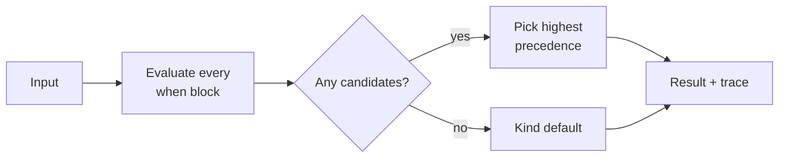

In most YAML rule engines, the first matching rule wins. That sounds simple until two teams edit the same file, one of them adds an approve rule near the top, and a deny rule further down stops firing. Nobody changed the deny rule; its position changed what it meant.

Sigil removes that failure mode. Every `when` block gets evaluated, independently and in no particular order, and the highest-precedence decision among all that fire wins. Moving a rule up or down in a file never changes the outcome.

## How a result gets picked



Each decision constructor that evaluation reaches becomes a _candidate_, carrying its decision name, reason, payload and source position. After every block has run, the evaluator looks at the kind's `precedence` declaration and picks the candidate whose decision ranks highest. With `precedence deny > review > approve`, one `deny` beats any number of `approve`s.

If nothing fires, the kind's `default` applies. For most kinds that's a deny, so an input nobody wrote a rule for fails closed.

Here's what that looks like with the `deploy.production` policy:

```sigil
when not eligible {
  deny("not_eligible")
}

when cleared {
  when service.tier == "critical"
    and "release_manager" in actor.roles {
    approve("release_manager")
  }
}
```

A release manager shipping a service that isn't managed by Argo CD produces two candidates, `deny("not_eligible")` and `approve("release_manager")`. Deny wins. Swap the two blocks and deny still wins, because the file order was never consulted.

## Nesting is conjunction, not sequence

A nested `when` fires only if every enclosing condition holds. The inner block above is shorthand for `cleared and service.tier == "critical" and ...`. Nesting exists to avoid repeating shared conditions, not to express "check this first, then that". Nothing short-circuits across blocks, and a decision reached in one block doesn't stop evaluation of the others.

That also means decisions don't `return`. `deny("soak_too_short")` builds a value, the way `Err("...")` does in Rust; the host acts on the winner after evaluation finishes.

## Why there's no `else`

`else` only makes sense relative to something that came before it, which quietly reintroduces order. Worse, it hides the negated condition. A reader has to scroll up to learn what `else` means, and a later edit to the `if` changes the `else` without touching it.

Sigil asks you to write the negation out:

```sigil
when eligible {
  review("eligible", approvers: approvers)
}

when not eligible {
  deny("not_eligible")
}
```

It costs one line. In exchange, each block states its full condition, a reviewer can read any block in isolation, and a diff that changes `eligible` visibly affects both.

## What the trace buys you

Because every block runs, the evaluator can report every candidate, not just the winner. The trace lists each candidate with its policy, reason and source position (the whole call chain, for a rule reached through invocations), and for the winner it records which conditions held. When someone asks "why was this denied and not approved", the answer is in the trace: the approve fired too, and deny outranked it.

A first-match engine can't give you that. It stopped looking after the first match.

## The one place order still leaks

Precedence settles conflicts between different decisions. It doesn't settle ties within one decision. If two `approve` rules fire with different bake times, something has to pick.

For the MVP, the earliest source position wins. A rule reached through an invocation takes its call site's position first, then its own position in the invoked file. It's a deterministic rule, so the same input still always produces the same result, and the trace shows every tied candidate so nothing hides. But it is an order dependence, and it's the only one left.

It bites in the canonical example. Take a critical service and an actor who is a release manager and also in the `payments-sre` team. `deploy.production`'s `approve("release_manager")` (bake 1h, the kind's default) and the team's `approve("payments_sre", bake: 15m)` both fire. The team file invokes `production(...)` above its own rule, so the release manager's approval counts as earlier and wins: the team asked for a 15-minute bake and the deploy gets an hour.

The cleaner answer is a merge function declared in the kind: take the minimum `bake`, or the union of `approvers`. That would remove the last trace of order from the language. It's listed under "Ties within one decision" in the [open questions](/project/open-questions/), and the normative rules live in [Evaluation semantics](/reference/evaluation/).

## What you give up

Order independence isn't free. You can't write "try the specific rule, fall back to the general one" as two rules in sequence; you have to make the general rule's condition exclude the specific case, or rely on the fact that the specific rule's decision has higher precedence. Authors coming from first-match engines find this awkward for about a day. After that, never again debugging "why did moving this rule break prod" tends to win them over.
